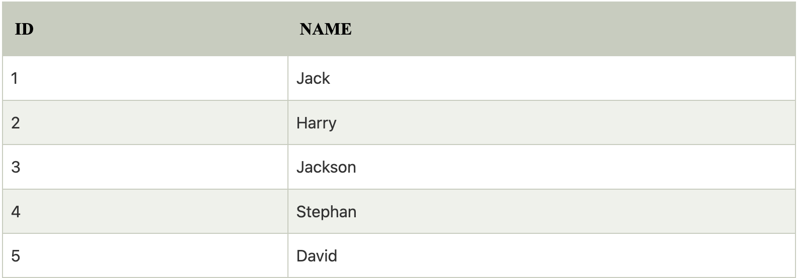
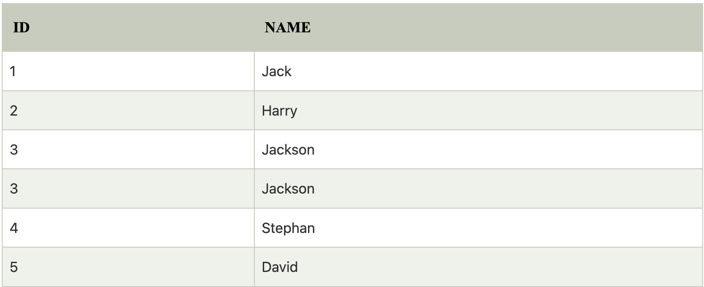
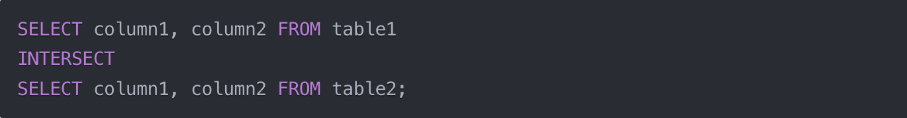
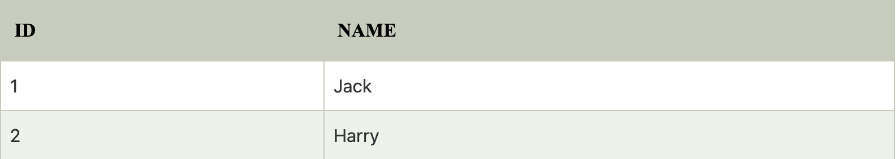

### Topic: Understanding SQL set operation and Null Values

#### 1.Set Operations
SQl set operation are operators in SQL that combines two or more queries into a single result set. There are four main set oprations namely, UNION, UNION ALL, INTERSECT, MINUS. Set operation are useful in manageing data from multiple source when we need to combine the dates from these sources.

- UNION: In this operation the multiple tables should have the same number of columns, same datatype, and of the same order for it to operate. If there are more than one type of same raw in the result set than it removes one of them indicating that its does not allow duplicate values.
    
     
    result table:
    

- UNION ALL: It is same as the UNION operation but the only difference is that it allows duplicate value in the result set.

    
    result table:
    

- INTERSECT: In this operator from the selected table it returns or shows the colunm rows only containing duplicate values. Same as UNION operation it requirs the same datatype and order.
    
    Result table:
    

- MINUS or EXCEPT: This operation returns only the rows that are present in the result set of the first seleted statement but not in the result set of the second seleted statement.
    
    result table:
    
---
#### 2.Null Values

Null value represents a missing value or a unknown value. It shows that while record creation the the values was left empy or blank. Null values can't be interpreted as zero or a empty string.

 - Some methods to handle null values
    

    coalesce() and isnul() function.
    