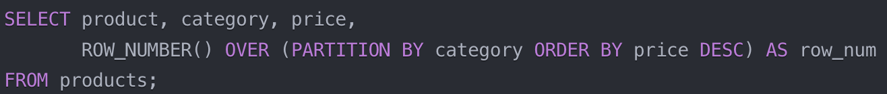
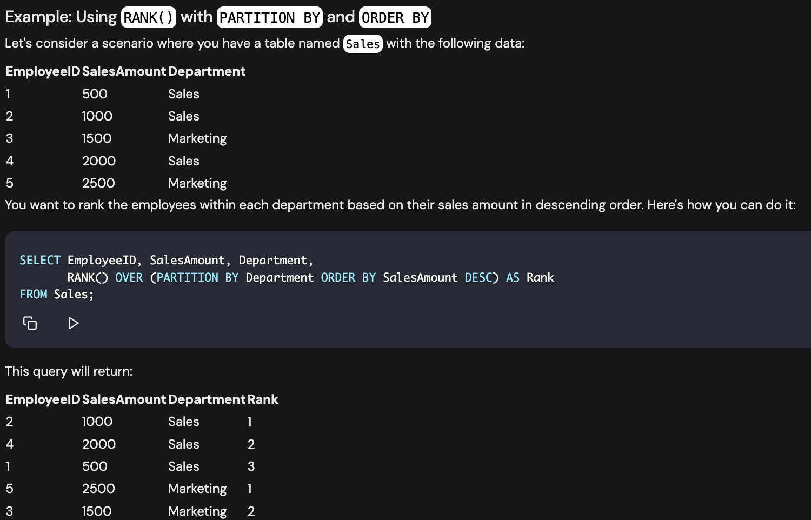

### Topic: Advanced Aggregation Function

From what I have learned is that, these function are more specialized function that operated beyound basic aggregation function like SUM, AVG, COUNT, MIN, MAX which are mostly used in other programming language and database. These opration can provide a complex calulation like percentile calculation, medain calcultion, mode calculation, standard deviation calculation, etc.

Some Advance Aggregation funtion are:

### Ranking

Rank function allows us to assign rank to row with in result set based on one or more column. THESE function are particulary used in when we need to analyze and report data based on rannking.

Some commonly used Rank funtion are:

- RANK(): This funtion assigns rank to each row with a partition, and if two data recieves the same rank than the next is skipped for the number of tied row.

    

- RANK_NUMBER(): It assigns a unique sequential rank to each row within a partition.

    

- DENSE_RANK(): Same as that of RANK() function it assigns rank to each row but if the there is a tie in the rank the next rank is not skipped.
    

- NTILE(n): This function divied the row within a partition into "n" numbers of equal sized group as possible and assigns group number to each group.

    
---

### Windowing

This function performs a calcution accross a set of table row that are somehow related to the current row  but, unlike normal aggregate functions they have access to individual rows and can even add some of their attributes into the result set. The use of window function does not cause rowsto become grouped into a single output row and identity of the row are rertained separately. It has access to more than just the current row.

THe window funtion are used with OVER() clause,(which define a set of row within the query result set.) The window funtion is defined by the the PARTITION BY() clause,(which divide  the result set into partition) and the ORDER BY() clause,(which orders the row within each partition).

The basic syntex of of a windows function is:
    
    
---

### Pivoting

Pivoting function are used to rotate a data from row to column or vice versa. This is useful when we need to present data in more condense or readable format.

There are two main pivoting function:

1. PIVOT(): This operator rotates rows into columns. It takes a set of rows and converts them into columns.

2. UNPIVOT(): This operator is opposit to POVIT() operator. It converts columns to rows.
---

### Rollup and Cube

Rollup and cube are advance grouping function that allows us to generate grand total in our result set.

    

