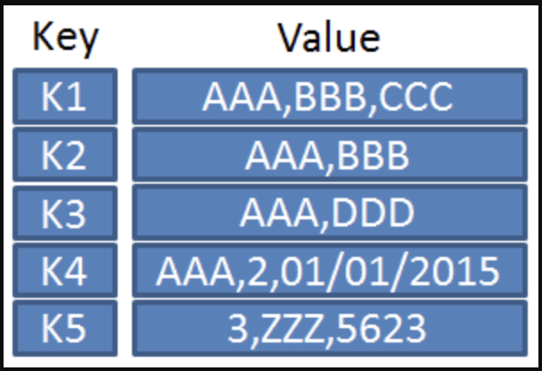
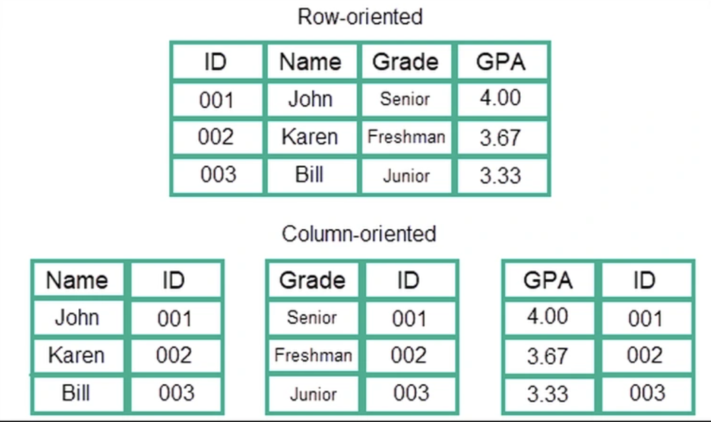
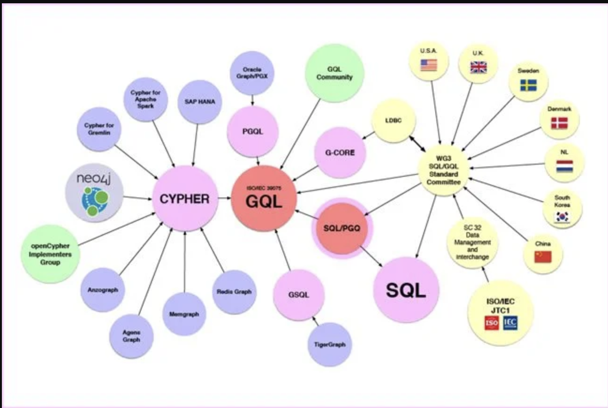
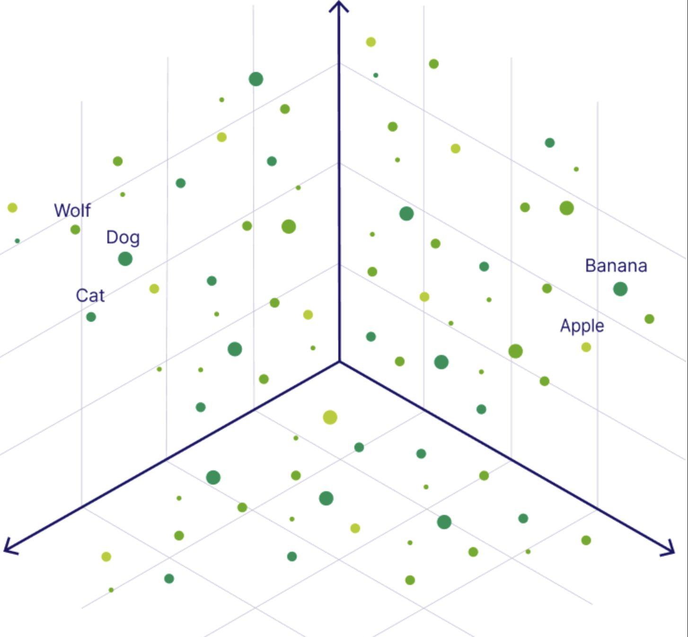
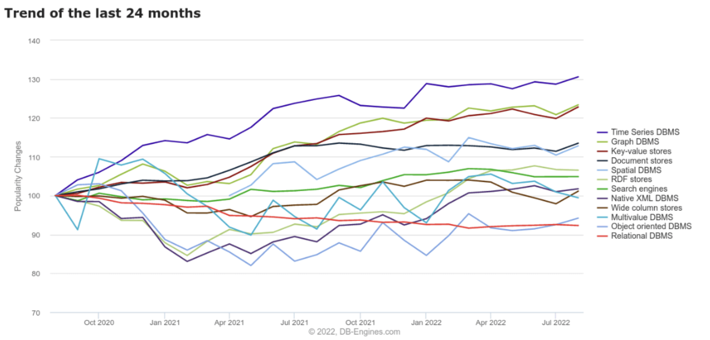

### Nonrelational Database or NoSQL Database

In this blog I will be sharing what we did our sixth flipped class. We went through Nonrelational Database along with their advantages, disadvantages and its applications. Before we move further lets learn about NoSQL, The data in Database are stored in tabular form but in case NoSQL the data are stored in non_tabular form and NoSQl stand for No only SQL.

---

### Types of NoSQL database

#### 1. Document-based database

It is a nonrelational database where data are not  stored in tabular form, instead it uses documentsto store data in the data base. The document database   store's data in JSON(JavaScript object Notation), BSON or XML documents.

#### Advantages

1. Flexible schema: It allows us to store without predefined schema, or a schema that can form over the time. Flexibility is particulary useful in application where the data model is not fixed or frequently changes.

2. scalability: It is designed to horizontally, so it allows us to distribute data across servers easily. This enables us to handle large volumes of data without sacrificing performance.

3. Easy to Use: They’re simpler to work with than some other types of databases. We don’t need to spend much time planning out how to store your data because you can just insert the data and go.

#### Disadvantage

- It can introduce overhead in terms of schema design and validation. Without a predefined schema, it's up to developers to ensure data integrity and consistency, which may require additional effort.

- Backup and Recovery process may be more complex than traditional relational databases.

#### Application

- Payment Processing: They can store transaction details, including payment methods, amounts, and statuses, facilitating the processing and tracking of payments.

- Mobile Apps: Document databases are well-suited for mobile applications, offering the flexibility to store and query data in a format that is easy to work with on mobile devices.

---

#### 2.Key-Value stores

It is the simplest form of NoSQL database and each and every data elemwnts are stored in key-value pairs. The data can be retrieved by using a unique key allotted to each element in the database. 

#### Advantages

1. Simplicity: Key-value stores have a very simple data model, which makes them easy to understand, use, and maintain without the need of complex schema.

2. High Performance: Key-value stores are designed for fast data retrieval and storage operations. it can handle a large number of read and write operations with low latency.

3. Efficient Storage: Key-value stores can store data efficiently.

#### Disadvantage

- The simplicity of the key-value data model can also be a limitation. It may not be well-suited for applications with complex or highly structured data models.

- Key-value stores typically do not offer proper data manipulation capabilities like those found in relational databases or other NoSQL databases.

#### Application

- Key-value stores are suitable for real-time analytics applications that require high-speed data ingestion and retrieval.

- It is used in gaming leaderboards with the ability to quickly store and retrieve high scores and player data makes key-value stores a popular choice for building gaming leaderboards.

---

#### 3. Column Oriented Database

Column oriented database are storeds the data in column instead of rows and when we want to run analytics a small number of columns, we can read those columns directly without consuming memory with the unwanted data.

#### Advantages

 - For scenarios with significant data sizes, columnar databases can minimize storage costs and optimize data retrieval speed. 

 #### Disadvantage

- Updating, inserting, or deleting data in columnar databases can be slower compared to row-oriented databases because each column must be updated separately which can be time-consuming.

#### Application

- They are beneficial for machine learning and AI applications, where large datasets are often used for training models.

- In the financial sector, they are used for storing and analyzing large datasets, such as transaction records, market data, and customer information. 

#### 4. Graph-Based database

Graph databases store data in nodes and edges. Nodes typically store information about people, places, and things, while edges store information about the relationships between the nodes. They are particularly effective for applications that require complex relationship analysis.

#### Advantages

- Graph database are designed to store and navigate highly connected data efficiently.

-They typically have a flexible schema-less data model that allows easy evolution and adaptation of the data structure as requirements change.

 #### Disadvantage

 - Graph databases can be more complex to understand and work with compared to other database models.

 ####  5. Vector Based 
 A vector database is designed to handle data that’s organized as vectors. These are just arrays of numbers that represent different aspects of the data.They are  good at finding similarities between different pieces of data, like words or images and can handle huge amounts of data efficiently, and also they work well for real-time analysis. It is used in machine learning and AI to handle lots of data with many dimensions.

 #### 6. Time-series Database

 Time-series Databases are a type of database desinged to store and process data that is organize or indexed with time. They are optimized for handling large volumes of time-stamped data, often generated by sensors, monitoring systems, or other sources that produce continuous streams of data points over time.

 

