##  Topic: Hack the box 

Hello welcome to my blog, today we will be learing on Hack the box starting point tier 0. We will be learning on how to get gained access to the system and the new tools and protocols we learned along the way.

Hack The Box is an platform that allows us to practice our penetration testing and cybersecurity skills in a legal and safe environment. It offers a variety of virtual machines (VMs) that simulate real-world scenarios, each containing vulnerabilities for users to exploit.

---

### Connecting to the hack the hack the Box VPN

To accces the machine in hack the box, we need to connect to the hack the box VPN. where it involves downloadin of certain file and running the command  "openvpn file_name" in the terminal. It is an essential for us to connect to the VPN for tier 0 as all the task are done by starting the machine.

- OpenVPN: Provides a safe and private method to reach resources on a network or browse the internet, which is useful for both individuals and organizations.

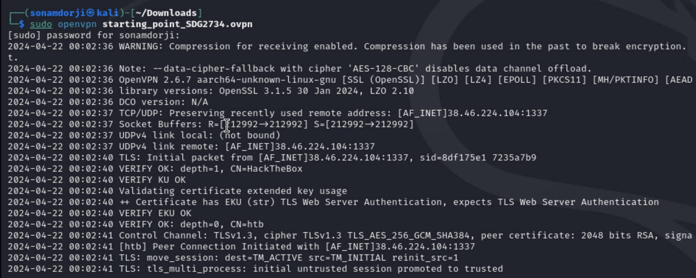

If your successfully connecting to the hack the box VPN than you will see test in green like in this image below and if not than it will in red text.

After this,  we can active the machine my clicking the “Spawn Machine” button. After the machine has been spawned you will be provided with th IP address which is used to communicate with the machine.

- **Note**: We must be on the same network to gain access to all the machines. Therefore, we should always be connected to Hack the boxs VPN. 

---

### Meow machine

#### Gaining Access to the System

The main task in this machine is to submit the root flag. So, to get the root flag I need to get into the meow machine. Firstly, I need to find out how many ports are open and what all services are running on each port.

After starting up the machine, I received a IP address. This IP address will be used to complete all the tasks on the machine.

Inorder to check wheather I am i can talk to the machine or not I used the "ping" command. Ping command is used to test if the machine can accept requests.

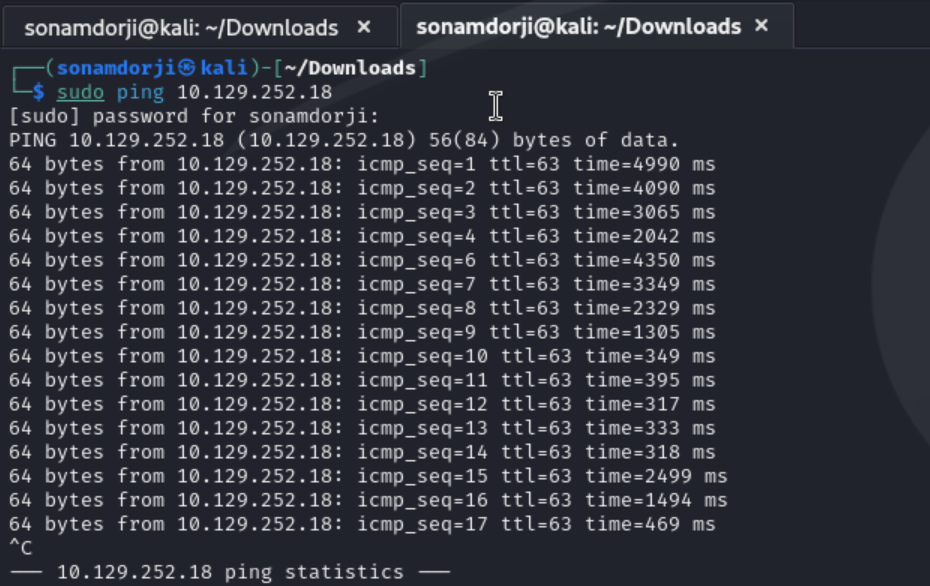

To check and know which ports are open and which server are available on the port I used "nmap" command. nmap command scans the network giving the informations about machine.

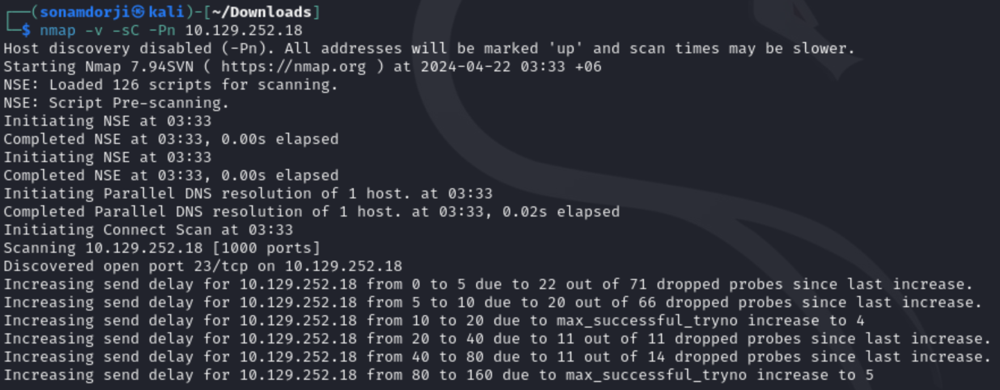
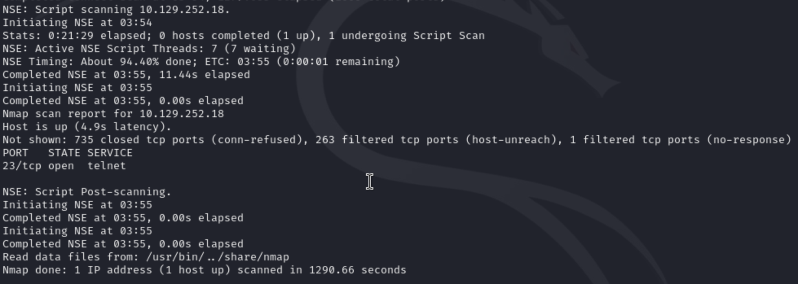

**Result**: Port 23/TCP is open and its running on server telnet.

As the scan showed that the server is only listeninng to telenet on port 23, I tried connecting to telnet server inorder to access the machine.

To login into the machine, I used root as my user and it worked.

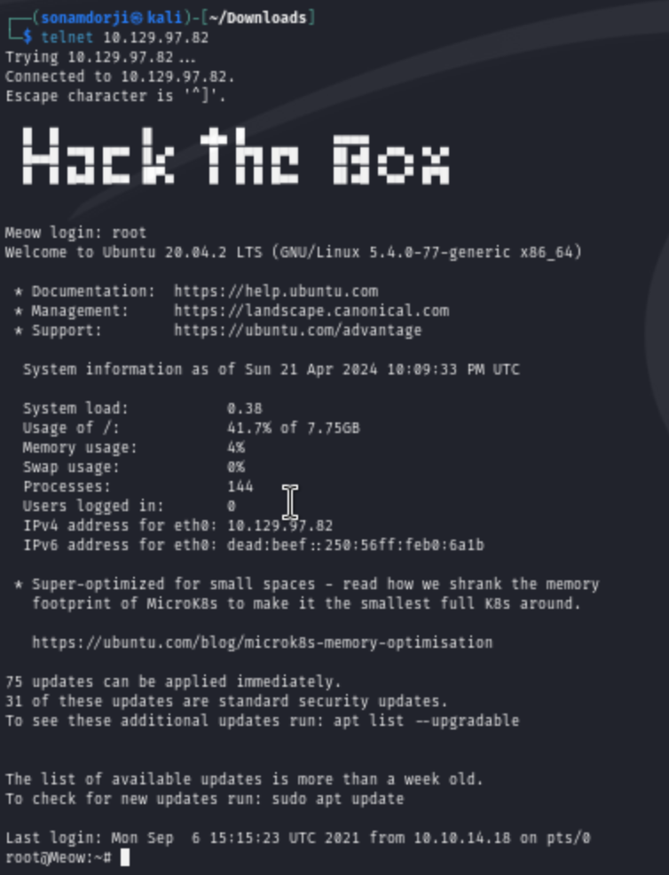

I have successfully logged into the machine and to answer the final question submit the root flag, I need to find the password which is hidden in some files. I found out that there is a flag.txt and snap file in the machine. I found the password while navigating into the flag.txt file.

### Command lines used

- ls: list all the files that are in the directory.
- cat:-display what’s inside the file.

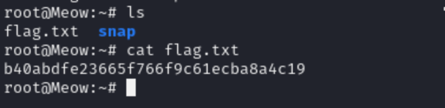

### Learning Through the Meow Machine

In this machine I have learned how to access the machine which is running on server Telnet.

- Virtual machine: It run different operating systems or software on your main computer without affecting its setup. It is like a computer within a computer

- Terminal: Is a shell, a program that allows users to interact with their operating system through a command-line interface.

- Ping: It allows a user to test if a particular destination IP address exists and can accept requests.
Nmap: It is used to scan a network. It identifies active devices and open ports.

- Telnet: Enables us to connect to to a local computer.

---
### Fawn

#### Gaining access to the machine

First, we need to check whether we are connected to the hack the box VPN. Same like the moew machine to get the IP address we need to start the machine by clicking the button “Spawn machine”. Remember this applies to all the machines.

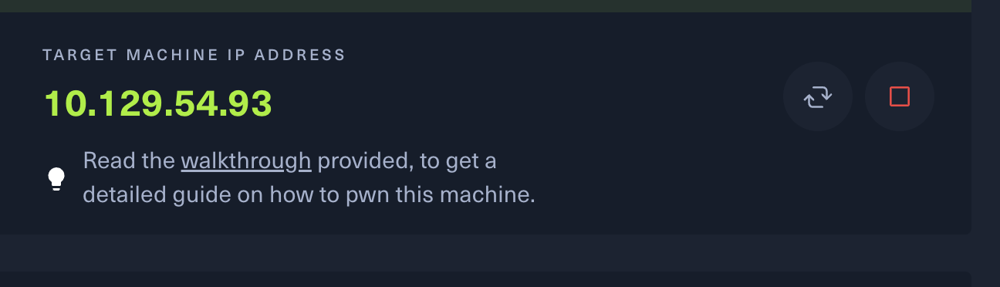

Before starting anything I check wheather my I could communicate with the machine or not by using the command "ping"

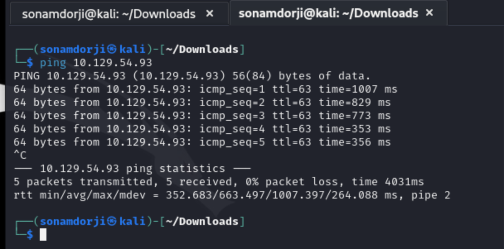

As i was confirmed that i was connected to the machine, I scanned the the network more by doing nmap

- The '-sV' is used to display the version of the services running on the open ports.

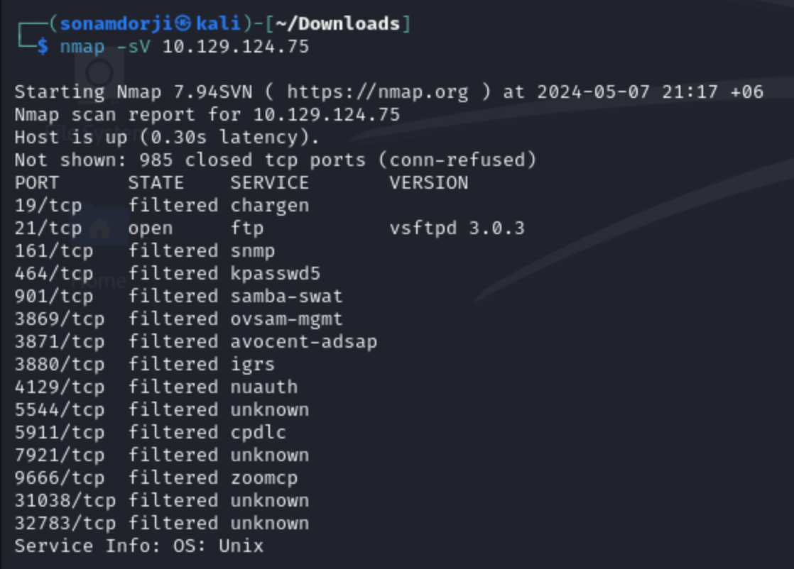

**Result**

- port 21/tcp running on service FTP 

unlike in meow machine' the Fawn machine is running on FTP service. So, I tried connecting to the the FTP service so gain the machines access. FTP(File Transfer Protocol) is service that allows user to transfer file between client and the server so we can take advantage of that to login in anonymously where FTP provides this feature to login to the server anonymously.

I was able to login successfull by just adding the user name as 'anonymous' and without entering the password.

After that I listed that was in that directory using the "ls" command I found out that there was file that contained a file called flag.txt. So I downloaded it using the "get" command. 

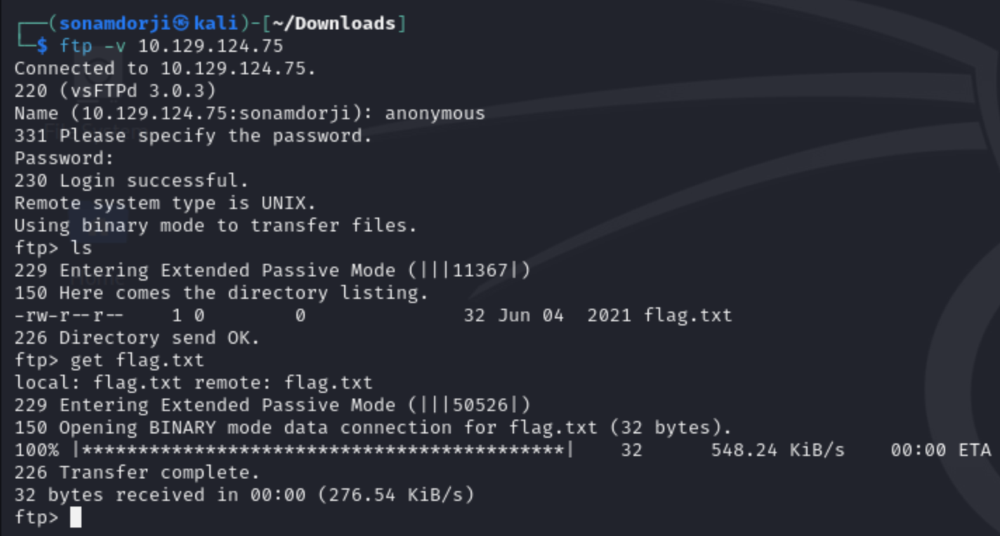

And after that I opend a new terminal and viewed the what was inside and I found that it contained the root flag.

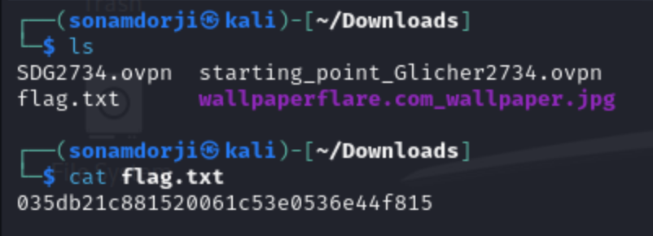

## learning through  the Fawn machine 

This machine introducted me to the fundaments of attacking a machine running on ftp server. I also learned that we can login in to a ftp server anonymousely using the username anonymouse and without a password or with random passwords.

- FTP(File Transfer Protocol):  is a server that helps transfer file between client and server.

- ftp -h: Is a command to view the help menu 

- Nmap -sV: It helps to scan the host using Nmap and and the -sV will give us the open with there version.

- get: its a command that help us to download file from ftp server.

---

### Dancing

#### Gaining access to the machine 

We should sure that we are connected to the same network, so that we can spawn the machine

- Target Ip address: **10.129.82.142**

Before anything I first checked wheather I was connected to the machine by pinging with the machine IP address. 

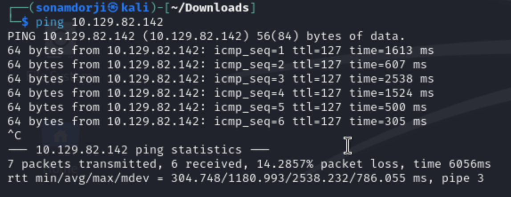

As I know now that I am connect to the machine I did a quick a nmap scan to check the open ports.

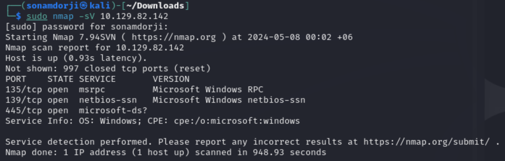

- we see that there are three ports opnen and anf port 445/tcp is the port that includes SMB functionality.

In SMB server the storage on the network is called "share". So I tried to list the contents that were in the server. and when I tried to login which required a password but without a password I logged in and could view the share in it.

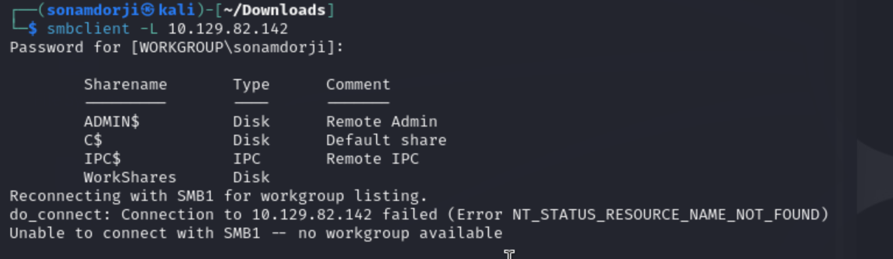

After listing it we could see that there were four shares in this in which  “workspace” is connected without providing any password. So, I tried navigating to the workspace and found out that there are 2 user directories, ‘Amy.J’ and ‘James.P’. 
So I tried go in both the users and found out that in "James.P" it contained the flag.txt so, I downloaded it using the get command.

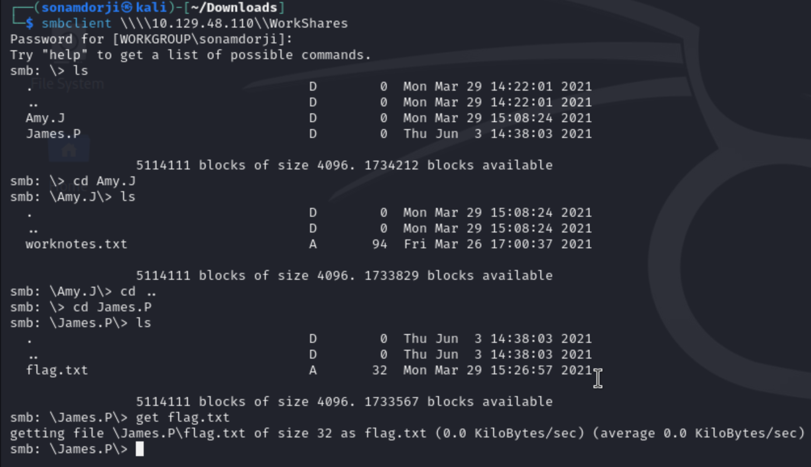

Than in checked what in the flag.txt file found out that it contained the root flag.

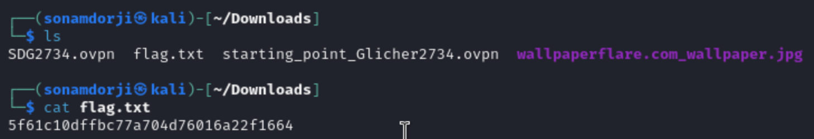

---

### Learning through Dance machine 

In this machine the main thing I learned is about SMB (Server Message Block) This communication protocol provides shared access to files. We mostly see SMB services running on Windows machines. And we can also download file from this server using the get command.

- smbclient: talks to an SMB server
- L: It will lists share on server and provide access to SMB resources.

---

### Redeemer

Same for all, we first need to do all the necessary connects with the for all the machines. 

- Target IP address **10.129.182.185**

First of lets do nmap scan to this machine see what we can find from this machine. 

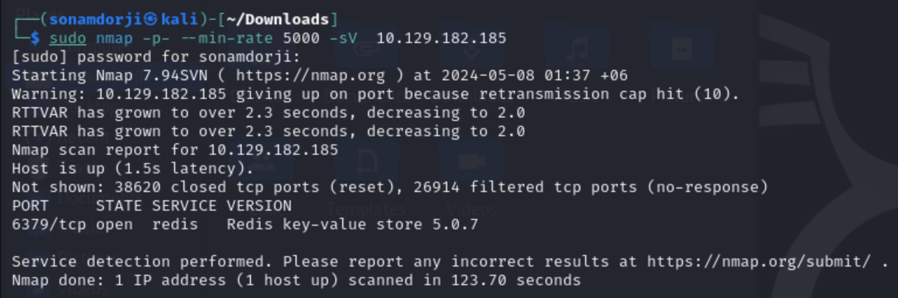

- Port 6379/tcp is open 
- This port is running on redis server.

Redis (Remote Directory server) is a in-memory open source NonSQL key-value data store used as database where data is stored in dictonary format using key-value pair.

After this used the `redis-cli -h ` to connect to the redis database where the -h show specify the host. And I got a insight that there only one database was present have index 0 and 4 values. 

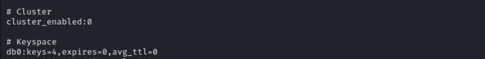

So I accessed the database using the key 0 and also used `keys *` to  get all the value in the redis database. And I found the value flag which got by using the `get ` command where i found the root flag.

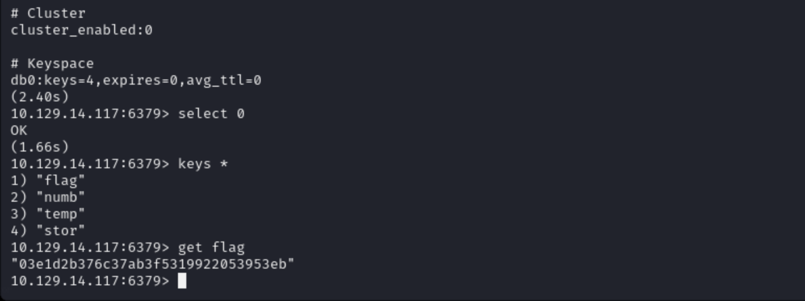

### learning through Redeemer machine

In this machine I was  able to learn about the redis server and knew how to gain access to the machines that are running in redis server.

- `redis-cli` is a command-line used to interact with the redis server.

- We can use `select` command to select the desired database in redis server and `keys *` to view all the keys.

- Redis: Redis (Remote Dictionary Server) is an open-source, in-memory data structure store, used as a database, cache, and message broker. The data is stored in a dictionary format having key-value pairs.

 

