## Topic: Hack the box Starting point tier 1

Hello again we will be doing hack the box tier 1 in this session. Same as that in tier 0 in this tier as well we will be trying to gain acess in different machine present in this tier.

### Appointment 

 **Gaining access to the machine**

Before  accessing the machine, we need to make sure that we are on the same network. After that we need to spawn the machine just like tier 0. So, by doing this I got the the IP address that I need to use to gain access to the machine. And the target IP address is:

**10.129.99.34**

First of all I did a nmap scan to search for ports that were open in the that machine. 

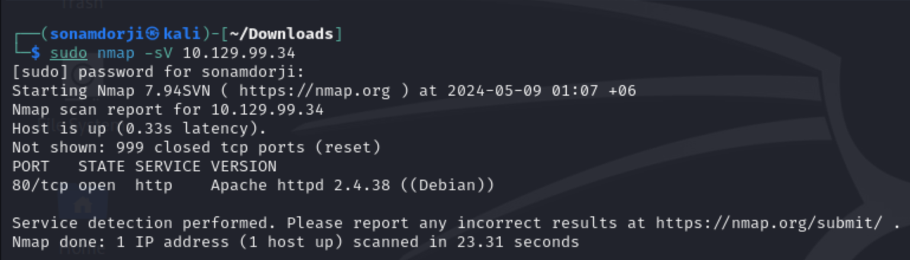

 **Result**

 - port 80/tcp http was open 
 - Running on apache server version 2.4.38

After this I typed the IP address into the browser I see a website of a login form. 

Log-in forms are used to authenticate users and give them access to restricted parts of the website depending on the privilege level associated with the input username.

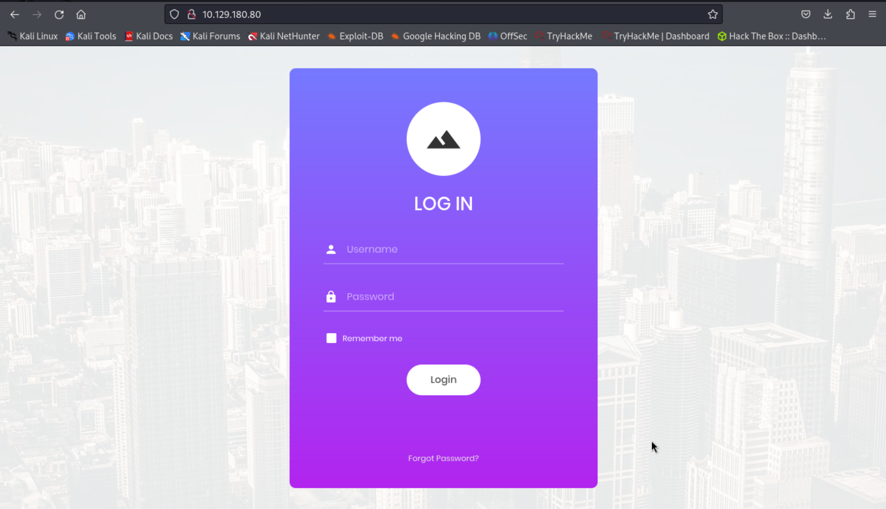

Hypertext Preprocessor(PHP) allows web developers to create dynamic content and interact with databases. So, in PHP, we can use `#` to comment lines of code. With this we can do SQL injection in the login form.

So, in the the user name I used "admin'# " is the username because  # code checks only for the usernames with admin and ignores the password.  And doing this, we can pu any value for the password.  Basically, using # code only checks the letters that are spelled before and ignores that are after the # code.

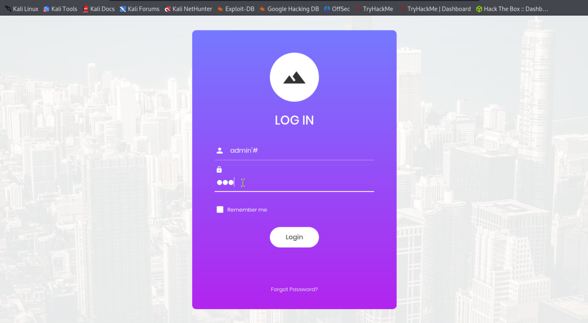

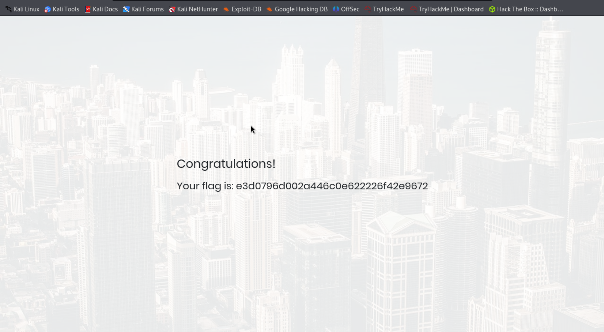

As you can see that i successfully logged into the this site which gave the root flag for this machine by using SQL injection.

---

### Learning from Appointment Machine 

in thi machine i have learned that HTTP server is he communication between the web server and client site. Ihave also learned that what a SQL injecction is when attackers insert malicious SQL code into input fields on a website, this allowes them to manipulate the database or access information.

- The `#` character in a line ignores every character that is after; by the server. Everything that is after the `#` is treated as command.

- Apache httpd server is used for running web pages 

---

### SequelAs 

**Gaining the mchines access**

As always we need to check and gain the machines access and the IP address for this machine is **10.129.95.232** or the target IP address.

So first of all i did a nmap scan to the to the target Ip address after knowing that i got access to the machine to check for open ports

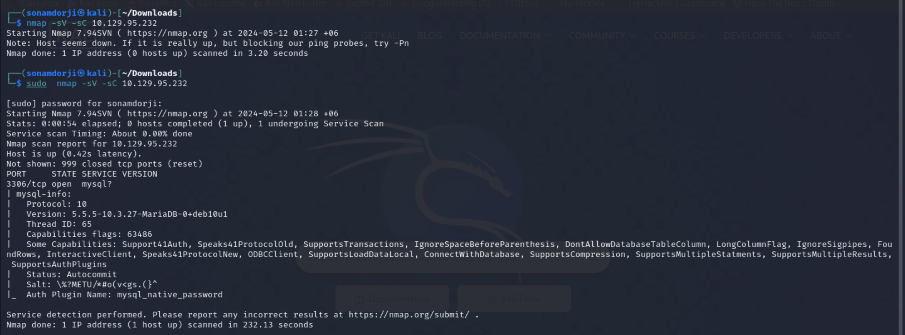

**Result**

- Port 3306/tcp  is open which is runnning on mysql server 

So tried to login to the MySQL by using the username as 'root' with using a password.

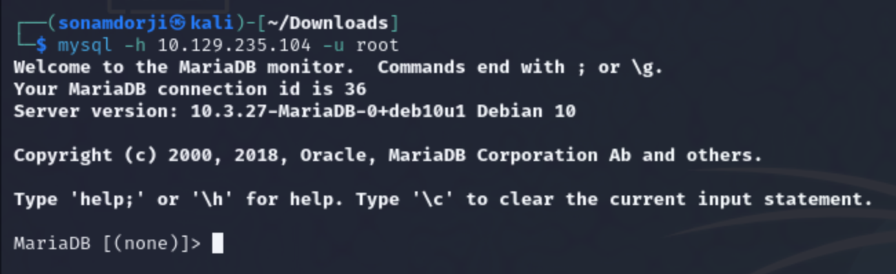

successfully I logged into the Mysql using root as the username without a password.

After that I views all the database that were in Mysql using the command ` SHOW databases`.

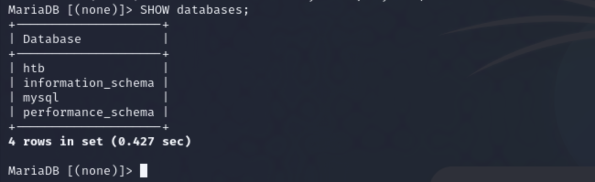

I found out that there were 4 databases and I in one was eye catching where it had a database called 'htb' which I thought was for Hack the Box so i used that database and vied all the tables inside that database using the command `SHOW tables;`.
 
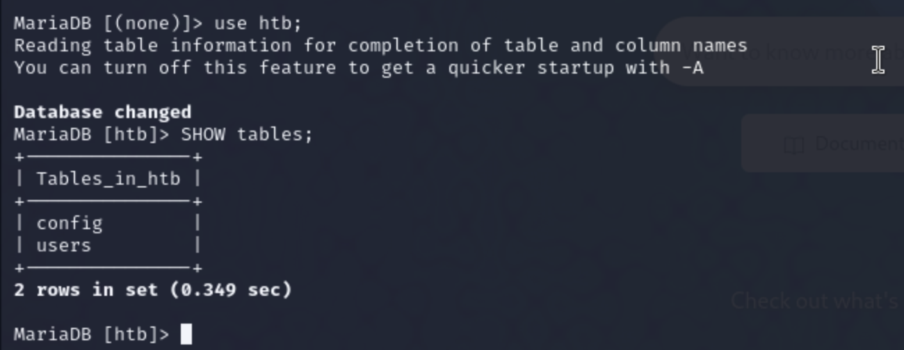

So I tried viewing all the conntents in both tables

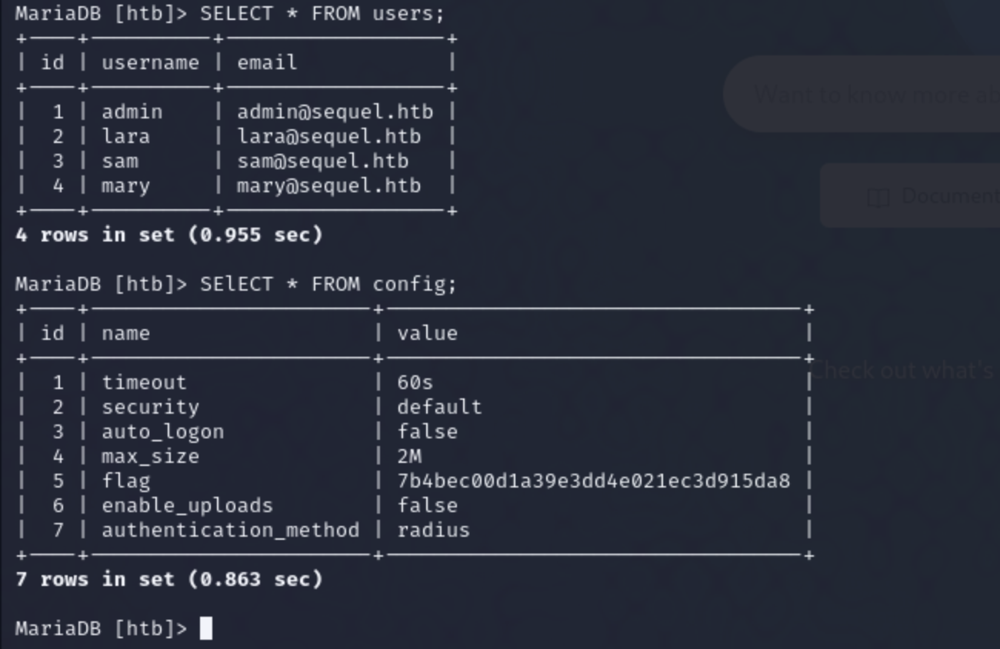

In the config I was able find the root flag

---

### Learning from Sequel Machine

In this machine learned that what a SQL (Structured Query Language) is how it is used to communicate with the database. In this machine, the server MySQL version is running on mariadb. So, mariadb is an open source database to help store and organize data.

---

### Crocodile

**Gain the machines access**

Gain the machines access and for this machine the IP address was **10.129.6.173**.

As always I did a nmap scan on this machine to look for open ports.

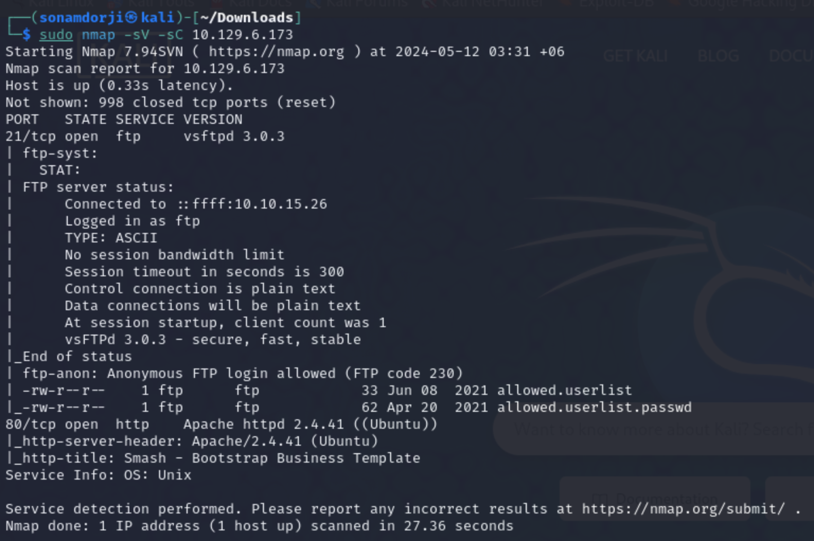

**Results**

- Port 21/tcp ftp  version  vsftpd 3.0.3 was open on this host 

- Port 80/tcp http version apache 2.4.42 was also open.

In a new tab I tired connecting to the ftp port by the username "anonymous". And i successfully logged in.

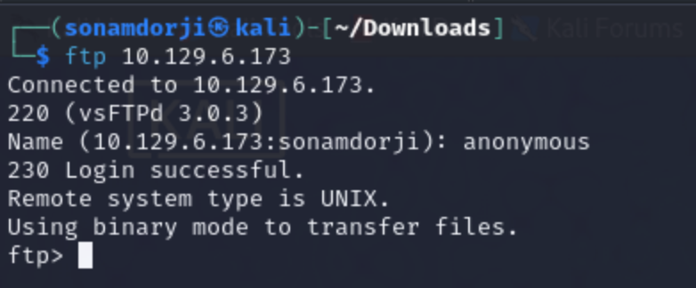

I listed all the contents in the this port and found 2 file "allowed.userlist" and "allowed.userlist.passwd". So I downloaded both both the file to check what was inside it. 

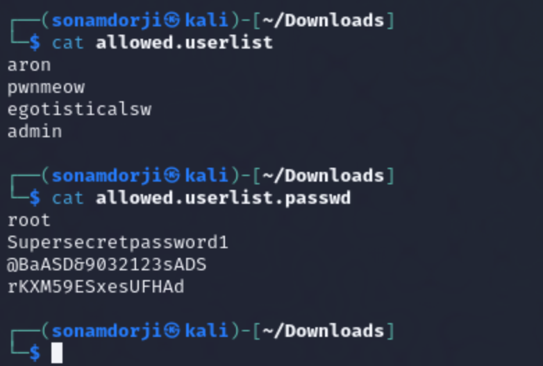

it contained a list of usernames and passwors for them. After the credentials have been obtained, the next step is to check if they are used on the FTP service for
elevated access or the webserver running on port 80 discovered during the nmap scan.

I used the IP address of this in browser and it retured me a web page about business company 

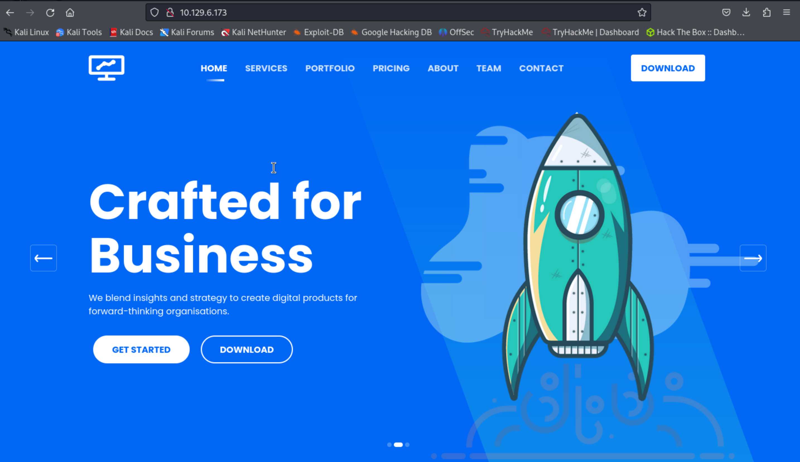

And after exploring the page i was not able to processed further so i used gobuter to find the directory in the website. Gobuster is a tool used to find the directories in the webpage or sometimes even hidden directory. I also used the the `-x` switch to specify the php and html since  PHP and HTML files will most commonly be pages. I might get lucky and find an
administrative panel login page that could help me to find leverage against the target in combination with the credentials I extracted from the FTP server.

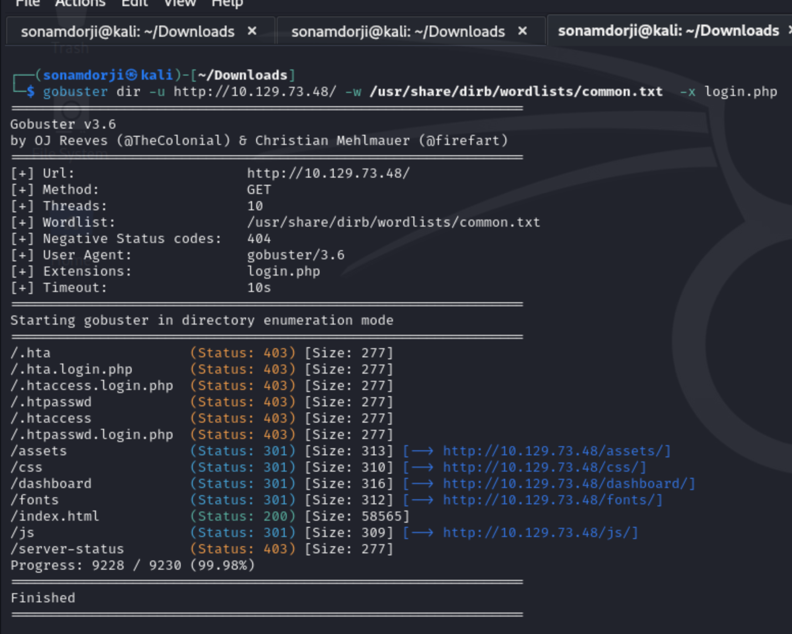

So we can see that I got a Login.php page that after scan with gobuster so i pasted the login.php in my browser and boom we found a page where we could use our credentails that we got from our ftp port.

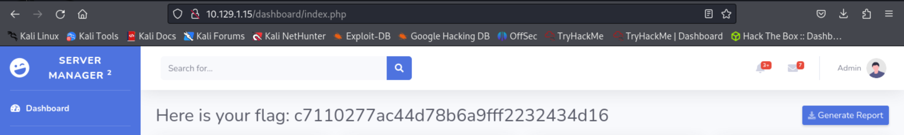

so i used the credentails and successfull logged in the there I foound the root flag for this machine. 

---

### Learning from crocodile machine 
 
- In this machine learned on we can find hidden directory in the webpage using a tool called  "Gobuster" where it is used to scan for diretories in a webpage.

- we can also use it to find hidden directory by using "-x" switch the specify the type of extention we want to scan for.

