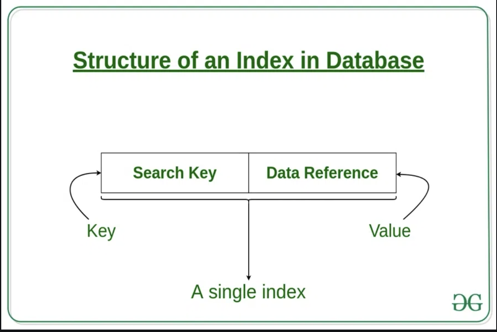
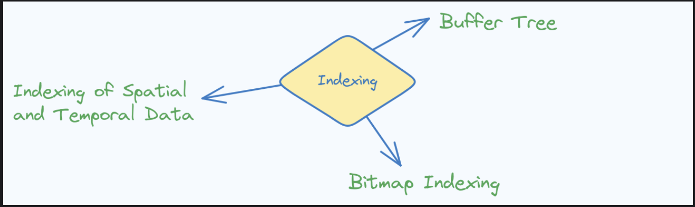
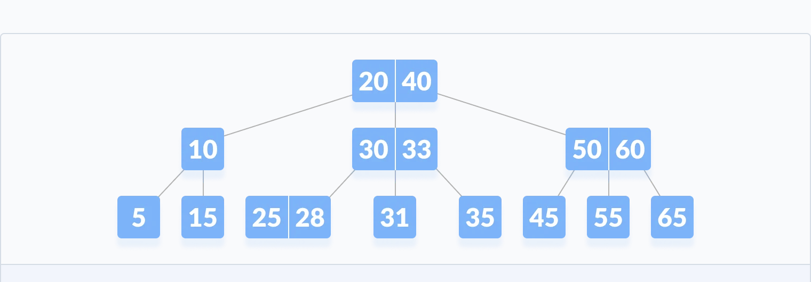
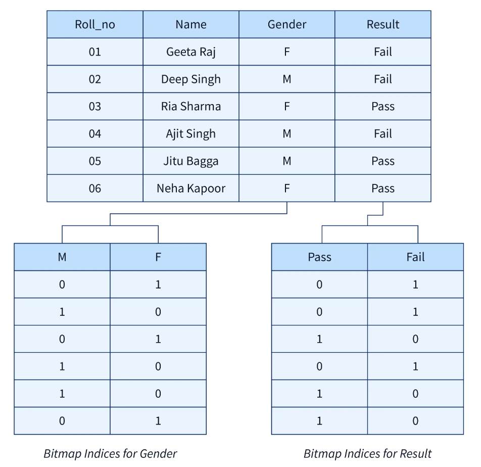

## Topic Indexing

What we did in this Flipped class 

For this Flipped class was different from rest of the others because this time our tutor did a different appraoch were she wrote song lyric on a rooled up paper and what we had to do was to uhh the song to recognise pur group members, which was refreshing and fun. With that  we were divided into six groups and were assigned topic on indexing. After that, started to conducted a quiz where we are splited into two groups which cover buffer tress, bitmapping, indexing of spital and temporal data.  was very challenging for both the teams but we all learned a lot from it. Lastly, both the team has equal points and we decided the winner by playing rock paper scissors. However, team B lost and we got chewing gum as our reward and other team got chocolate. This flipped class was a great experience and I learned a lot from it.

---

### Indexing 
So, now moving on with our main motive what is indexing ? Indexes are a powerful tool used in the background of a database to speed up querying.
Indexes power queries by providing a method to quickly lookup the requested data. Simply puttting, an index is a pointer to data in a table. An index in a database is very similar to an index in the back of a book. It helps data structure to improves the speed of data retrieval operations on a database table at the cost of additional writes and storage space to maintain the index data structure.

**How are indexes created?**

In a database, data is stored in rows which are organized into tables. Each row has a unique key which distinguishes it from all other rows and those keys are stored in an index for quick retrieval. Since keys are stored in indexes, each time a new row with a unique key is added, the index is automatically updated. And corosponding to the key are their value.

---

### Types of indexing

**1. Buffer trees (B-trees)**

B-trees are self-balancing tree data structures used for indexing, particularly in databases and file systems.

- Balanced Structure: They keep the balance to make sure that the operations are efficient like search, insertion, and deletion in O(log n) time.
- Variable Node Size: No two nodes can have the same number of child nodes which is the range that is either the order or the degree of the tree. 
- Splitting and Merging: Nodes splits when they are full and merge when they are too empty, thus the balance is maintained.

- Indexing Efficiency: The perfect solution for indexing in databases since the disk-based storage access is very efficient, thus the disk I/O operations are reduced.

- Optimal for Large Datasets: B-trees, in turn, handle large datasets and thus massively cut down the access times for different operations.

To begin with, the buffer tree is the process of breaking the data into smaller, more manageable parts, called buffers. Next, these buffers are organized in a tree-like structure, where each buffer is stored in a node of the tree. The tree is set up to be balanced, which means that the tree is kept as low as possible and the data can be accessed faster.

**Advantage of B-trees**

- Efficient Disk Access: Buffer trees are the factor which reduces the number of disk I/O operations by having frequently accessed data in the memory. The memory optimization increases the speed of the data retrieval and manipulation operations, thus, the whole system becomes more efficient.
 

 
- Balanced Tree Structure: Such as B-trees, buffer trees also keep a balanced structure, hence, the operations such as search, insertion, and deletion are performed in O(log n) time, which is fast.
 

 
- Optimal Use of Memory: Buffer trees are the means of the optimization of memory usage by the caching of the data which is accessed very frequently in the buffers. This method lessens the requirement of data being fetched from disk which thus, eliminates the latency and increases the response times.
 

 
- Support for Large Datasets: To say the least, buffer trees are the perfect tool for dealing with the large datasets which cannot be totally stored in the memory. The local servers in the memory cache the most often accessed parts of the dataset, thus, the users can access the data on the disk efficiently.
 

 
- Adaptability to Workloads: The flexible trees can change their caching policy according to the workload patterns. They put the first on caching the data that is often needed and remove those that are not so much needed, to optimize the usage of the resources according to the demand.
 

 
- Concurrency Control: The trees of buffer usually have the features for the data to be accessed and transactions to be managed at the same time, thus, they make the data consistent and integrated for the users in the multi-user environment.

---

### Bitmap Indexing

Bitmap indexing is a kind of indexing where a unique attribute value is represented by a bitmap, and each bit signifies a record or a row in the database. The bit is set if it is (1) and it represents the attribute value, but if it is not, it stays unset (0).

- Space Efficiency: Bitmap indexes are highly space-saving, especially for low-cardinality attributes (attributes with a small number of distinct values). They are stored in a very small space, allowing only one bit per record per attribute value.

- Fast Query Processing: Bitmap indexes are the best option for the quick processing of queries, mostly for the queries that contain multiple attributes or the complex conditions. Binary operations like AND, OR, and NOT can quickly merge the bitmaps to identify the matches.

- Ideal for Data Warehousing: Bitmap indexing is the usual option in data warehousing situations where analytical queries need to perform aggregations, slicing and dicing over different dimensions. It is a real time or a faster execution that the OLAP queries give.

- Suitable for Sparse Data: Bitmap indexing is optimal for sparse data, in which many attribute values have a low selectivity. e. , occur infrequently). In these cases bitmaps are sparse and bitwise operations are still efficient.

- Maintenance Overhead: Although bitmap indexes can increase the efficiency of a query, they can also cause a higher maintenance cost, especially when it comes to data modifications (insertion, modification, deletion). The database has to be updated as well, hence the changes in the bitmap indexes will influence the performance.

- Hybrid Approaches: Sometimes, the solution is not to choose one of the bitmaps or other indexing techniques, but to go for a hybrid approach, where the bitmap indexing is combined with other indexing techniques. g. , B-trees) can be utilized to realize a fair co-existence of query performance and maintenance overhead.

--- 

### Indexing of Spatial and Temporal Data

Spatial and temporal data are indexed by means of organizing and structuring the data to satisfactorily facilitate spatial and temporal queries that are based on the location and time criterias, respectively. Here are some common indexing techniques used for spatial and temporal data:Here are some common indexing techniques used for spatial and temporal data:
 

**Spatial Indexing:**

- R-tree: The most of the times, the spatial indexing technique which is the most utilized. R-trees are the structure that sorts out the spatial objects (e. g. cars) in two dimensions. g. , points, rectangles) hierarchically thereby making it possible to perform spatial queries like range searches and nearest neighbor queries efficiently.
 

 
- Quadtree and Octree: Hierarchical spatial indexing structures that progressively divide the space into quadrants (for 2D data) or octants (for 3D data). Quadtree and Octree structures are applied in spatial indexing in cases where objects are evenly or not evenly distributed.
 

 
- Grid Indexing: It subdivides the spatial domain into a cell grid, which in turn, provides for the effective spatial partitioning and indexing. Grid-based indexing is most applicable to regular and evenly distributed spatial data.
 

 
**Temporal Indexing:**
 

 
- B-tree with Timestamps: A typical B-tree indexing, with temporal attributes such as timestamps, as the example of traditional B-tree. B-trees are able to create a good index of temporal data by the timestamps, thus, the retrieval of the records based on the time ranges are fast.
 

 
- Temporal Interval Trees: Another version of interval trees which is geared towards temporal data is also possible. Temporal interval trees are built in such a way that they arrange intervals along a timeline, thus making it possible to quickly perform temporal range queries and interval overlaps.
 

 
- Temporal R-tree: A version of the R-tree that is designed for data indexing that varies over time. R-trees are the ones that group the objects according to their spatial extent and temporal duration; hence, they make the queries which involve the spatial-temporal criteria.
 

 

 

 

 

 

 

