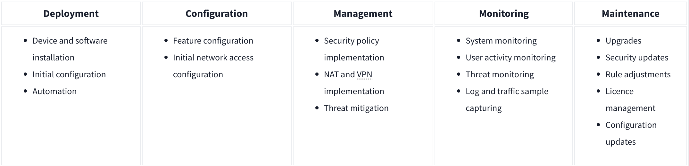
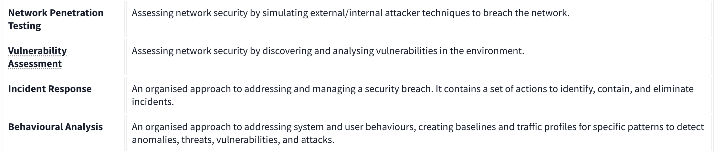
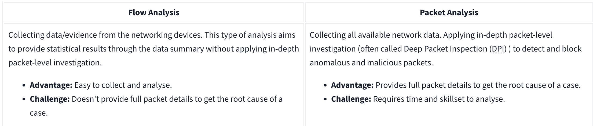

### Introduction

Network Security is a set of operations for protecting data, applications, devices and systems connected to the network. It focuses on the system design, operation and management of the infrastructure to provide network accessibility, integrity, continuity and reliability. Mainly focusing on keeping data and application safe that are connected to netwok.

Network traffic analysis is the process of monitoring and analyzing network traffic to detect and respond to security threats, performance issues, and operational anomalies. It involves capturing and inspecting data packets as they move across a network to gain insights into the behavior and characteristics of network traffic.

### Network Security and Network Data

#### Network Security

Network security involves the protection of computer networks and their infrastructure from unauthorized access, misusing, modification, or denial of service. It encompasses various technologies, processes, and practices designed to defend networks, data, and systems from cyber threats.

It main focus of network security are authentication and authorization.

**Base Network Security Control Levels**

- Physical: It prevent unauthorised physical access to networking devices, cable boards, locks, and all linked components.

- Technical: It prevent unauthorised access to network data, like installing pathways and implementing security layers.

- Administrative: Provide consistency in security operations like creating policies, access levels and authentication processes.

There are two main approaches and multiple elements under these control levels. 

**The key elements of Access Control:**

- Firewall protection: Controls incoming and outgoing network traffic with determined security rules. It is designed  to block malicious traffic and application layer while allowing legal and expected traffic.

- Network Access Control (NAC): Before the device is connected to the it checks wheather the device is suitable to connect to the network

- Identity and Access Management (IAM): I checks wheather the right user can access the right data on the internet.

- Load Balancing: It insure the data usage and imporves the overall processing flow.

- Network Segmentation: Splitting the network into different group to improve users access level and improve the protection of sensitive internal devices data in the network.

- Virtual Private Networks (VPN): creates a safer encrypted communication between the device that are in the network.

- Zero Trust Model: It configures before giving access to the user. "Never trust, always verify".

**The key elements of Threat Control:**

- Intrusion Detection and Prevention (IDS/IPS): It monitors the traffic and point out the threads.

- Data Loss Prevention (DLP): monitors the traffic and blocks the extration of sensitive data.

- Endpoint Protection: protects the endpoint by encrypting all the data.

- Cloud Security: It protects the cloud by applying sutable security like VPN and data encryption.

 

 Network Security Management Operation is explained in the given table:
 

 #### Managed Security Services

 Managed Security Services (MSS) are outsourced solutions provided by Managed Security Service Providers (MSSPs) to address security needs for organizations lacking internal resources or expertise. MSS offers cost-effective options, whether managed internally or by MSSPs, and can be tailored to specific requirements. These services simplify engagement processes, providing quick access to essential security measures without extensive setup. By outsourcing security management, organizations can focus internal resources on core operations while MSSPs handle monitoring, analysis, and incident response, enhancing overall security posture efficiently.

 

 ---

 ### Traffic Analysis

Traffic Analysis is akin to being a detective for your computer network. It involves examining and interpreting the data traffic flowing through the network. The primary objective of Traffic Analysis is to identify potential threats and vulnerabilities that could compromise the security and integrity of the data and applications connected to the network. By meticulously scrutinizing the network traffic patterns, Traffic Analysis aims to safeguard sensitive information and applications from unauthorized access, malicious activities, or other cyber threats. It serves as a vigilant watchdog, continuously monitoring and analyzing the digital communication channels to ensure the confidentiality, availability, and resilience of the network infrastructure.

There are two main techniques used n traffic analysis:

 

Benefits of the Traffic Analysis:

- Provides full network visibility.
- Helps comprehensive baselining for asset tracking.
- Helps to detect/respond to anomalies and threats.

