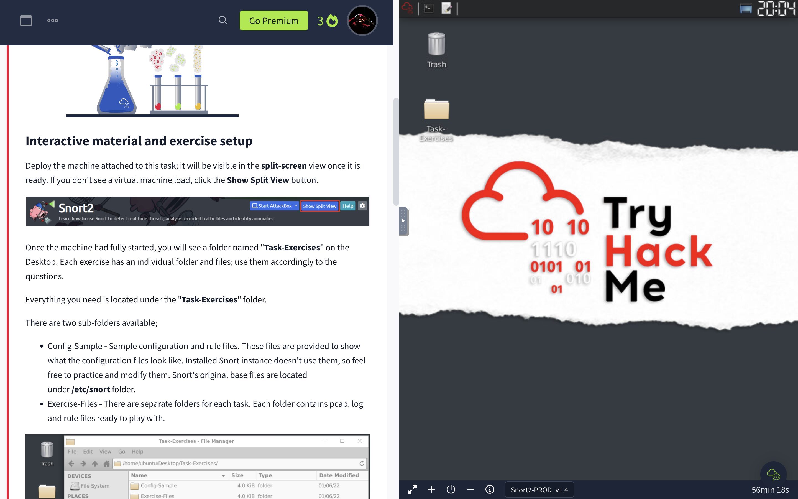
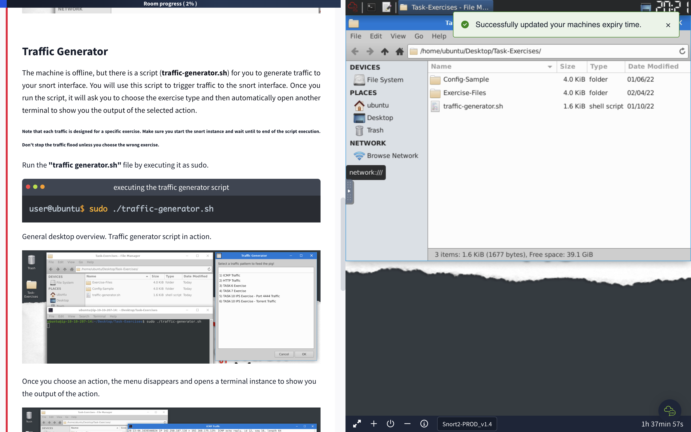
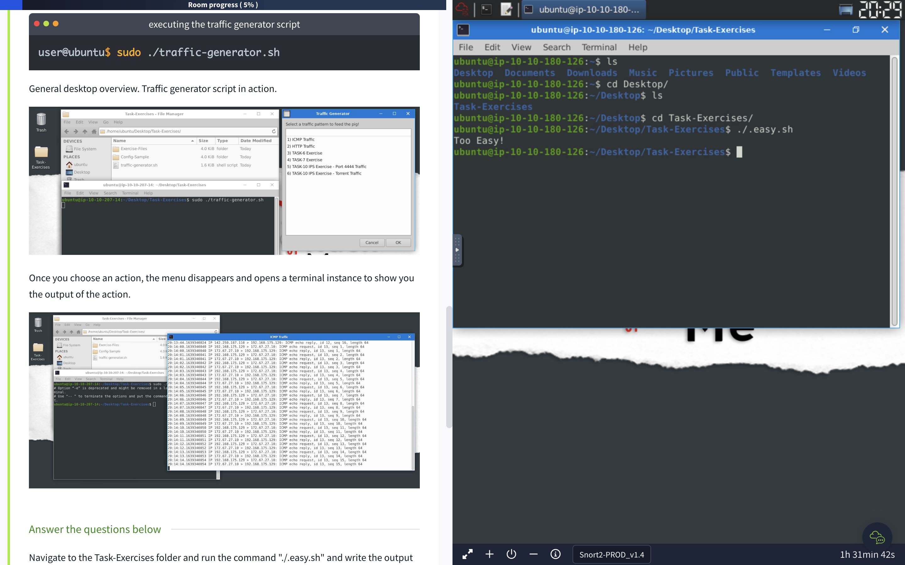
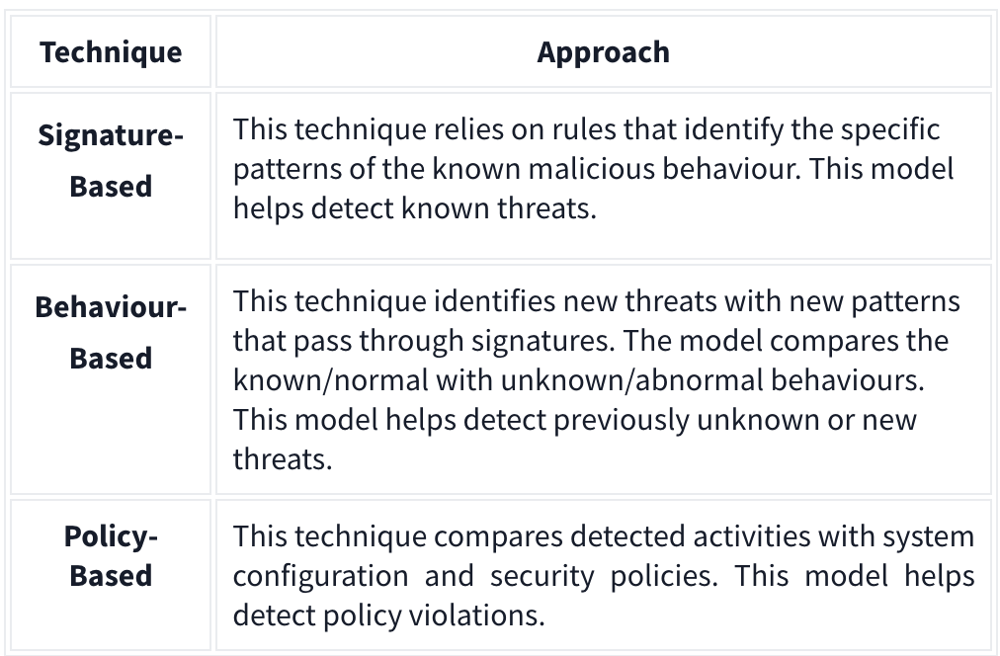
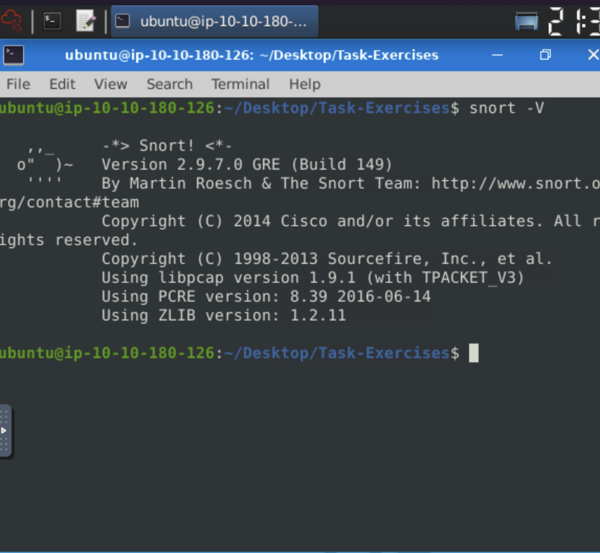
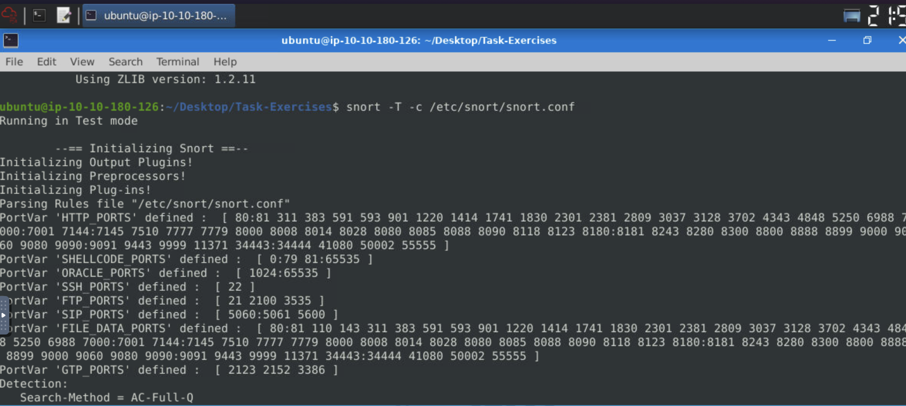
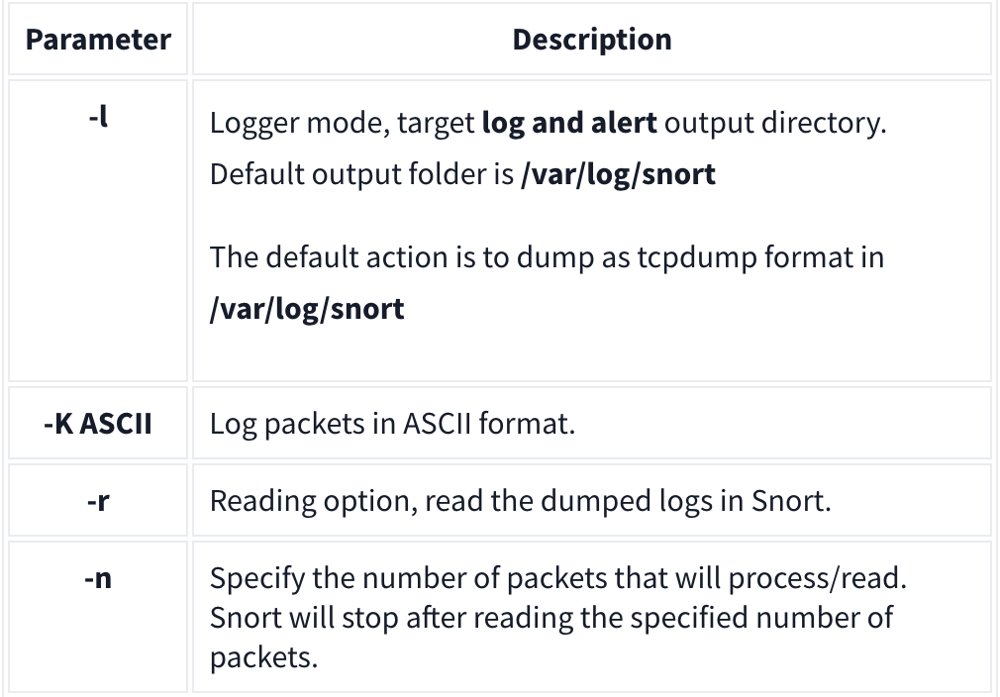
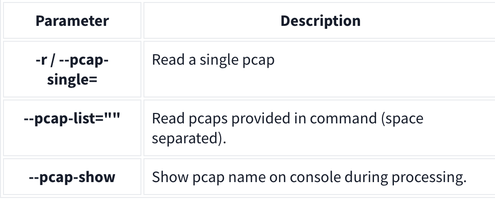

## Snort 

### Introduction

In this room we will be learning basic Linux command-line functionalities like general system navigation and Network fundamentals (ports, protocols and traffic data).

### Interactive Material and VM

First of all I started the machine to do all the task in this room.

After successfully starting the machine it popped a desktop where navigated to the "Task-Exercise folder" and found the following:

- Config-Sample - Sample configuration and rule files. 

- Exercise-Files - There are separate folders for each task.

- traffic-generator.sh -  generate traffic to your snort interface.

So as instructed in the task I went to the "Tash-Exercise" and and ran tthe command `./.eash.sh`. the output given to me was "Too Easy!".

---

### Introduction to IDS/IPS

#### Intrusion Detection System (IDS)

IDS is a passive monitoring solution for detecting possible malicious activities/patterns, abnormal incidents, and policy violations. generating alerts for each suspicious event. 

There are two main types of IDS systems;

- Network Intrusion Detection System (NIDS) - NIDS monitors the traffic flow from various areas of the network. The aim is to investigate the traffic on the entire subnet.

- Host-based Intrusion Detection System (HIDS) - HIDS monitors the traffic flow from a single endpoint device. The aim is to investigate the traffic on a particular device.

#### Intrusion Prevention System (IPS)

PS is an active protecting solution for preventing possible malicious activities/patterns, abnormal incidents, and policy violations. terminating the suspicious event as soon as the detection is performed.

There are four main types of IPS systems;

- Network Intrusion Prevention System (NIPS) - NIPS monitors the traffic flow from various areas of the network. protects the traffic on the entire subnet.

- Behaviour-based Intrusion Prevention System (Network Behaviour Analysis - NBA) - Behaviour-based systems monitor the traffic flow from various areas of the network.

Difference between NIPS and NBA
 
| NIPS | NBA |
|------|-----|
| this system does not require training period. | this systems require a training period (also known as "baselining") to learn the normal traffic and differentiate the malicious traffic and threats.|
| this wont be much an issue as no training period is there and the malicious event can be detected within a instince. | In case of any security breach during the training period, the results will be highly problematic.|

- Wireless Intrusion Prevention System (WIPS) - WIPS monitors the traffic flow from of wireless network. protect the wireless traffic and stop possible attacks launched from there.

- Host-based Intrusion Prevention System (HIPS) - HIPS actively protects the traffic flow from a single endpoint device. investigate the traffic on a particular device.

**Note:**

- HIPS working mechanism is similar to HIDS. The difference between them is that while HIDS creates alerts for threats, HIPS stops the threats by terminating the connection.

**Detection and Prevention Techniques**

### First interaction with Snort
 
    snort -version

Snort parameters 

     -V or --version: Check the Snort version

     -c: Specifies the location of the  configuration file.

     -T: Runs a self-test on the file to validate it, without actually starting Snort.

     -q: Run Snort in quiet mode to suppress the default output.

The version of snort is 149.

To test the current instance with “/etc/snort/snort.conf” file and check how many rules are loaded with the current build, I used the following command:

    snort -T -c /etc/snort/snort.conf

---

### Operation Mode 1: Sniffer Mode

This are the differnt snort sniffer modes:

- -v -Verbose. Display the TCP/IP output in the console.
- -d -Display the packet data (payload).
- -e -Display the link-layer (TCP/IP/UDP/ICMP) headers.
- -X -Display the full packet details in HEX.
- -i -This parameter helps to define a specific network interface to listen/sniff. Once you have multiple interfaces, you can choose a specific interface to sniff.

Sniffing with parameter “-i”

    udo snort -v-i eth0

Sniffing with -v

    sudo snort -v

Sniffing with parameter “-d”

    sudo snort -d

Sniffing with parameter “-de”

    sudo snort -de

Sniffing with parameter “-X”

    sudo snort -X

---

### Operation Mode 2: Packet Logger Mode

Packet logger parameters are explained in the table below;

#### Logfile Ownership

When we run Snort with the sudo command, the generated log files will be owned by the root user.

We can investigate the log files using two options:

- Elevate your privileges using sudo or sudo su to access the files as the root user.
- Change the ownership of the files/directories to your user account using sudo chown username file or sudo chown username -R directory. The command
   
        sudo snort -dev -K ASCII

---

### Operation Mode 3: IDS/IPS

Snort can work as a guard to detect problems (IDS mode) and also act to prevent them (IPS mode), along with its abilities to sniff and log packets.

NIDS mode parameters:

- -c :Defining the configuration file.
- -T :Testing the configuration file.
- -N :Disable logging.
- -D :Background mode.
- -A: Alert modes

**IDS/IPS mode with parameter "-c and -T"**

Start the Snort instance and test the configuration file. This command will check our configuration file and prompt it if there is any misconfiguratioın in our current setting.

    sudo snort -c /etc/snort/snort.conf -T

**IDS/IPS mode with parameter “-N”**

Start the Snort instance and disable logging by running the following command:

    sudo snort -c /etc/snort/snort.conf -N

**IDS/IPS mode with parameter “-D”**

Start the Snort instance in background mode with the following command:

    sudo snort -c /etc/snort/snort.conf -D

---

### Operation Mode 4: PCAP Investigation

Capabilities of Snort are not limited to sniffing, logging and detecting/preventing the threats. PCAP read/investigate mode helps you work with pcap files. Once you have a pcap file and process it with Snort, you will receive default traffic statistics with alerts depending on your ruleset.

**Investigating single PCAP with parameter "-r"**

For test purposes, you can still test the default reading option with pcap by using the following command 

    sudo snort -c /etc/snort/snort.conf -q -r icmp-test.pcap -A console -n 10

**Investigating multiple PCAPs with parameter "--pcap-list"**

    Investigating multiple PCAPs with parameter "--pcap-list"

**Investigating multiple PCAPs with parameter "--pcap-show"**

    sudo snort -c /etc/snort/snort.conf -q --pcap-list="icmp-test.pcap http2.pcap" -A console --pcap-show

### Snort Rule Structure

**Action**

There are several actions for rules. Makeing sure we understand the functionality and test it before creating rules for live systems. The most common actions are listed below.

- alert: Generate an alert and log the packet.
- log: Log the packet.
- drop: Block and log the packet.
- reject: Block the packet, log it and terminate the packet session.

**Protocol**

This defines the network protocol to be inspected (e.g., IP, TCP, UDP, ICMP). You can detect application-level traffic by using port numbers and rule options, even if the protocol is not explicitly specified.

For example, to detect FTP traffic, you can use a TCP rule with port 21.

**Rule Options**

Provides additional criteria to match the traffic.

- Msg: Provides a brief message or identifier for the rule.
- Sid: Unique identifier for the rule. Should be greater than 100,000,000.
- Reference: Optional reference to external information like CVE IDs.
- Rev: Revision number for the rule.

### Snort2 Operation Logic: Points to Remember

Main Components of Snort:

- Packet Decoder - Packet collector component of Snort. It collects and prepares the packets for pre-processing. 
- Pre-processors - A component that arranges and modifies the packets for the detection engine.
- Detection Engine - The primary component that process, dissect and analyse the packets by applying the rules. 
- Logging and Alerting - Log and alert generation component.
- Outputs and Plugins - Output integration modules (i.e. alerts to syslog/mysql) and additional plugin (rule management detection plugins) support is done with this component. 

**Types of Snort Rules:**

- Community Rules - Free ruleset under the GPLv2. Publicly accessible, no need for registration.
- Registered Rules - Free ruleset (requires registration). This ruleset contains subscriber rules with 30 days delay.
- Subscriber Rules (Paid) - Paid ruleset (requires subscription). This ruleset is the main ruleset and is updated twice a week (Tuesdays and Thursdays).

**Snort Configuration Files:**

- snort.conf: Main configuration file.
- local.rules: User-generated rules file.

