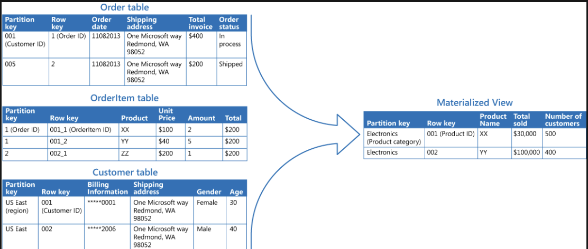
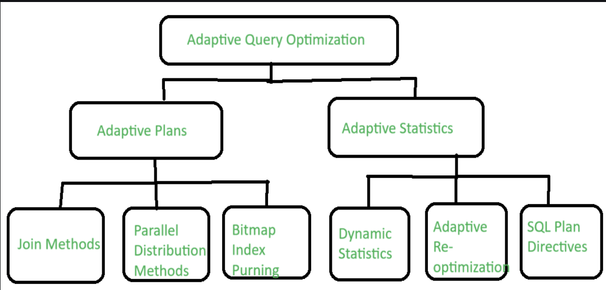

## Query Optimization 

What we did in the Flipped Class ?

In this flipped class, it is was same as in the previus class where we a were divied into group's of six and we were given topic to be discussed. And the topic that we got we were asked to make question form those topic for the quiz that we conducted in the end. In our case the topic we got was Advance Query optimization and we prepared five question from the our side. During the quiz we were the four groups were than fused to two and each had to do was ask question to the their opponents and based on that we were given points each on correctly answering the question. At the end my group won and our tutor treated us with candy like in the prevoius one. But anyhow the flipped class turned out well and we learned alot from it and enhencing than normal classes.

### What is Query Optimization?

Query optimization is the procedure which involves the means of improving the processing of queries in the database by selecting the most efficient manner to carry them out. Suppose that you create a query in a database query language such as SQL; then the DBMS has to figure out the way of getting requested data from the underlying tables. Deciding the specific indexes to use, the best join algorithm to utilize, and what order to chose among the parts that make up a query is the core of query optimization.

There are many ways to optimize the querying of data but we will be focusing more on Materlized View And through view how we can optimized the query of data. We will also be focusing more on Advance Query Optimization as well. 

### Metralized View 

First of all what is metralized view, A materialized view is a duplicate data table created by combining data from multiple existing tables for faster data retrieval. For example, consider a retail application with two base tables for customer and product data. The customer table contains information like the customer’s name and contact details, while the product table contains information about product details and cost. The customer table only stores the product IDs of the items an individual customer purchases. You have to cross-reference both tables to obtain product details of items purchased by specific customers. Instead, you can create a materialized view that stores customer names and the associated product details in a single temporary table. You can build index structures on the materialized view for 
improved data read performance.

### Advantage of using  Meterailized view and how Query is optimized

Speed
  
- Queries browse through several tabels and rows of data in order to pick the required information. A materialized view provides us with the ability to interrogate data directly against the view instead of needing to figure out data every time. The more complicated is our question, the greater is the time saved when you materialized view is applied.
  
Data storage simplicity
 
- Materialized views views help you put complex query logic in one table. Such advantage simplifies the data progression as well as the software development. It is also useful in simplifying the complex task of formulating complicated queries. You can also reduce the amount of data replicated in the view to have less data copying using data subsetting.
  
Consistency
 
- Materialized views offer a snapshot of data ingested at a particular point in time and make it stable. You can set reading consistency in the materialized view and make data available even in an environment of multi-user where concurrency control is absolutely necessary.
Not only the materialized views but also the data access are granted even for the  situation where the source data gets updated or is deleted. In the long run it gives you a chance to look on the materialized views as a source of reporting on time based data snapshots. The fact that you are working with a single fixed degree of separation from source tables gives you the freedom of keeping the data consistent.
 
Improved access control
 
- Through materialized view, there is possibility to control access to specific data so that it is possible only for a certain group of persons. You can provide users a typical database experience without exposing source tables to them. This technique will come in handy if you wish to track who can view which data, how much of it they can view, and the privilege level they have to interact with it.

### Advanced Topics in Query Optimization

There are many topics related to this topic but today I will be discussing on  the topic that we discussed during this class. 

**1. Top-k optimization**

The common mechanism of building answers to top-k queries searches for the k top or bottom items in a ranking according to a defined criterion. For instance, a cybersecurity analyst, in the process of analyzing a possible threat, operates by framing a top-k query that retrieves the one thousand most recent logs produced from a specific IP address. Or a data analyst at a bank could be using this query type to get the last 100 transactions made with a given merchant if there is a dispute regarding it. 

**2. Cost Based Query Optimization**

Cost Based Query Optimization metrics optimizer decides a cost to each possible activity which the query may perform. And ultimately, all these factors can be totaled to establish a cost estimate of that plan. for every query the optimizer assigns a cost associated with each step of each of the feasible plan in go for binary tree like execution plan. Such values are then collated and used to determine the price of that specific plan. It could form a plan with the least cost among all the possible plans since the cost estimate of the plan was the lowest. Cost based optimization in Cost Based Query optimization involves assigning a quantitative cost to each topic in a tentative planning for a specific sql query. These are accumulated and further evaluated to obtain the cost estimate for that particular plan. The optimizer calculates the cost of all the possible plans and as a result; it estimates one specific plan to be the lowest one and thus concludes that it can choose the plan. west cost estimate.

**3. Adaptive Query Optimization**

The most common example is the Adaptive Query Optimization where the optimizer is able to look at run time information and adapt the execution plans or find additional information that would allow optimization to occur. The use of statistical data becomes useful when the currently available numbers are insufficient to derive the plans from.

**4. Automatic Tuning Optimizers**

Different optimizers do different things according to whether their methods are called or not. This includes following two types:This includes following two types:
 
- Normal Optimization: It is an optimization technique where optimizer reads the query and generates an execution plan within a given time duration.
 
- SQL Tuning Advisor Optimization: During this, optimizer is engaged in additional processing for further producing an efficient plan. An optimizer is the process that yields a number of actions, alongside their estimated effect on the plan.

