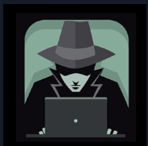
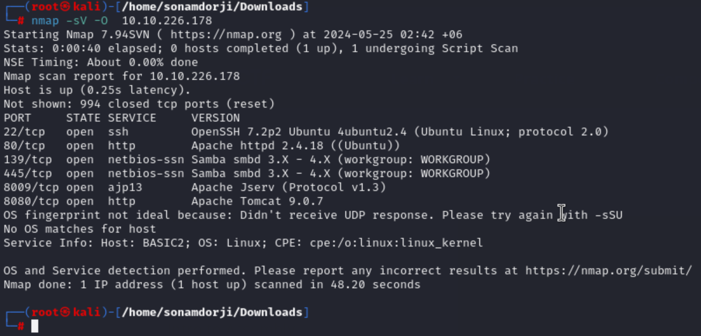
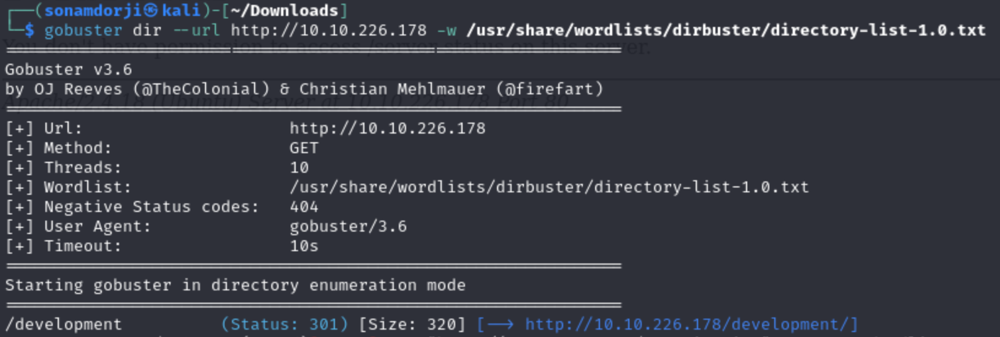
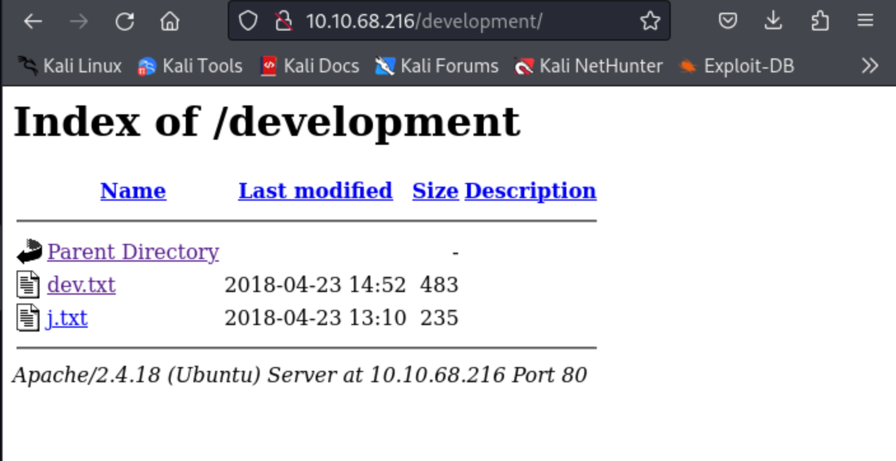
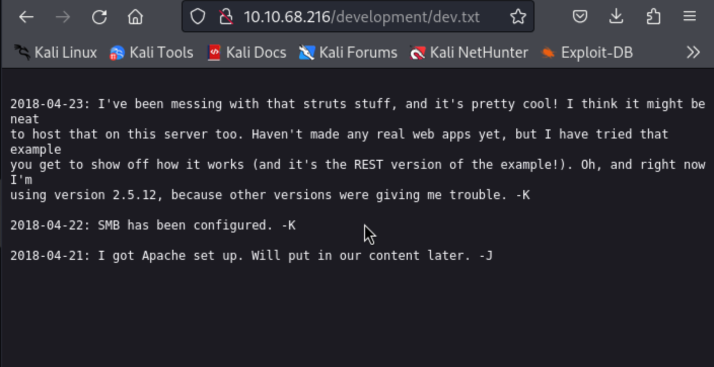
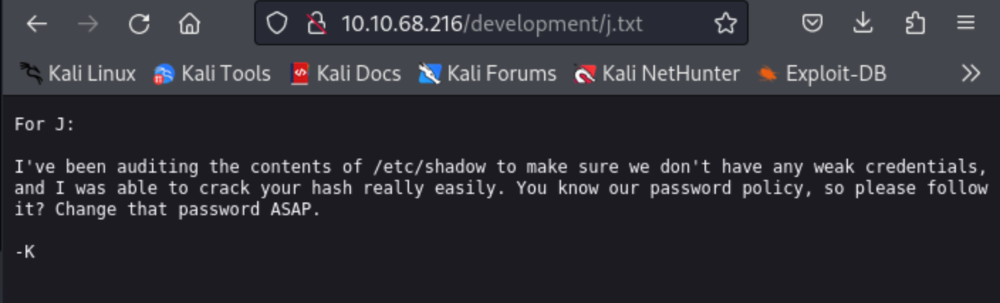

## Basic Pentesting 

In this room we will be learning 

- brute forcing 
- hash cracking 
- service enumeration
- Linux Enumeration

So the first thing I did is that I connect my vpn and started the machine which gave me IP address for the machine  

From the IP Address I got i did a nmap using the the ip adress to find open ports in the this machine.

**Result**

- Port 22/tcp, 80/tcp, 139/tcp, 445/tcp, 8009/tcp, 8080/tcp are open in this machine.

The second task was to find the hidden directory in the web server so inorder to do  this I used gobuster(tool to find hidden directory in a web server) to move further.

After using gobuster I carefully analysed the result and I found out that the hidden directory was "develpoment" which the answer to the second task. After i ofund out the hiden directory when to that endpoint 

 
 Inside this i found out two text file so, go throught this 

 1. 

 2. 

 from the above in can get some information like:
 
* There are minimum 2 users (J and K, not the real usernames)
* Website is using Apache 2.5.12
* Website is also using SMB (samba)
* User J is having a weak password (most important)

The third task was to find the username and password using brute-force. So If we go back and look at the nmap scan result, you will see that the samba(smb) service is running. So I’ll use `enum4linux` program to find users.

