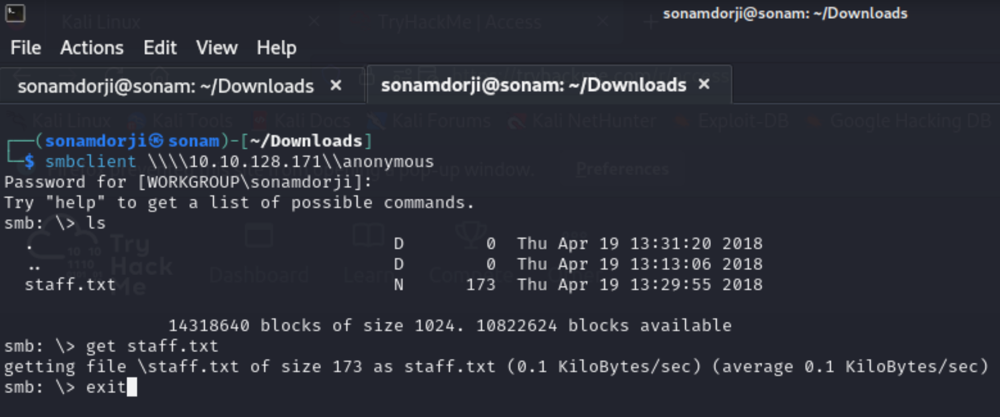
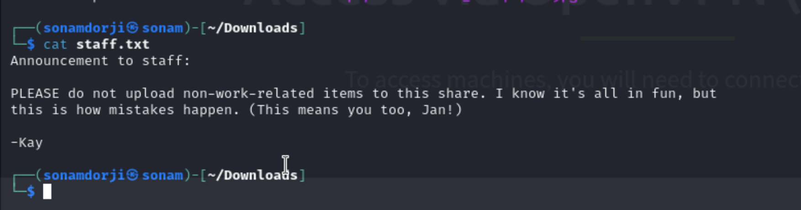
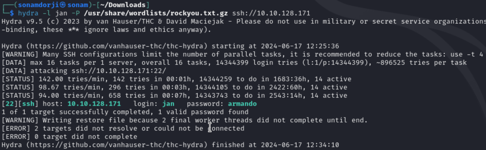
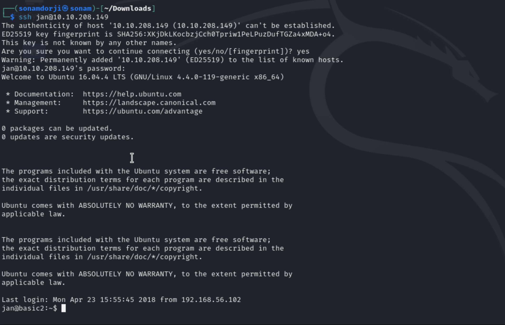
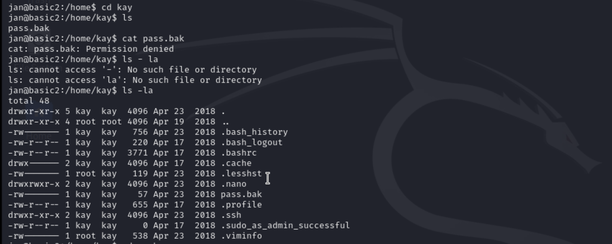
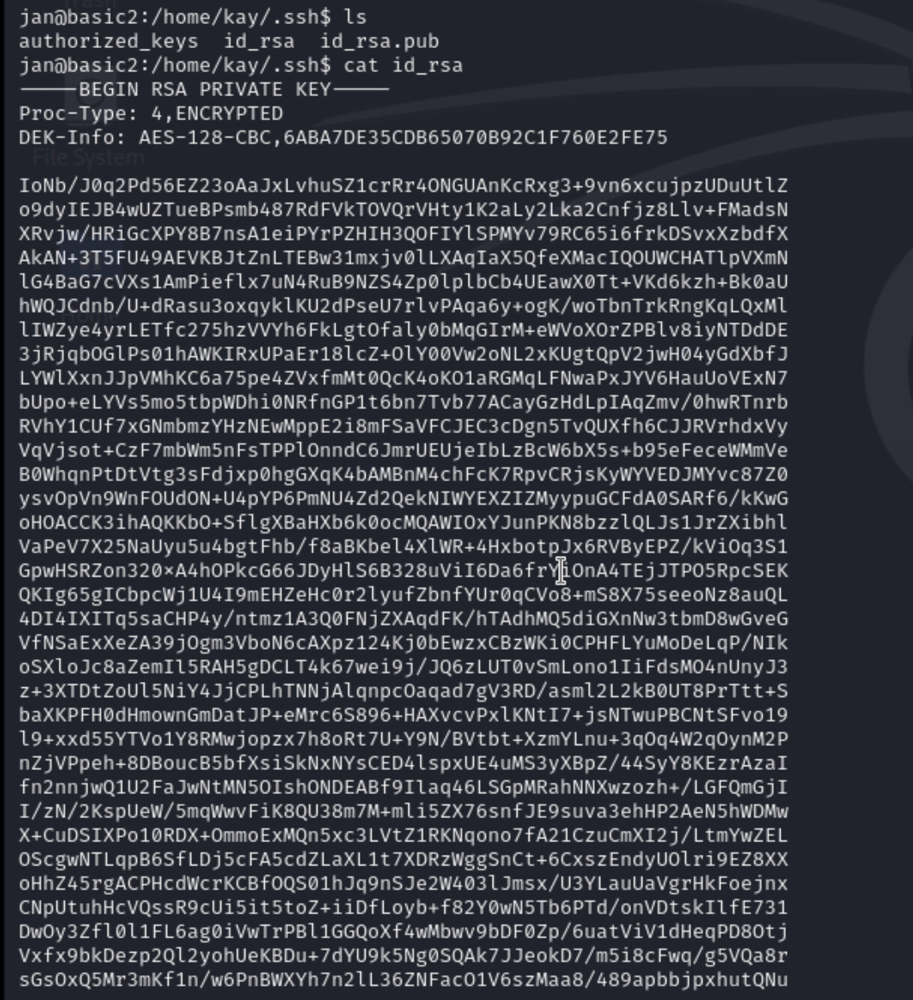

## Basic Pentesting 

In this room we will be learning 

- brute forcing 
- hash cracking 
- service enumeration
- Linux Enumeration

So the first thing I did is that I connect my vpn and started the machine which gave me IP address for the machine  

From the IP Address I got i did a nmap using the the ip adress to find open ports in the this machine.

**Result**

- Port 22/tcp, 80/tcp, 139/tcp, 445/tcp, 8009/tcp, 8080/tcp are open in this machine.

The second task was to find the hidden directory in the web server so inorder to do  this I used gobuster(tool to find hidden directory in a web server) to move further.

After using gobuster I carefully analysed the result and I found out that the hidden directory was "develpoment" which the answer to the second task. After i ofund out the hiden directory when to that endpoint 

 
 Inside this i found out two text file so, go throught this 

 1. 

 2. 

 from the above in can get some information like:
 
* There are minimum 2 users (J and K, not the real usernames)
* Website is using Apache 2.5.12
* Website is also using SMB (samba)
* User J is having a weak password (most important)

The third task was to find the username and password using brute-force. So If we go back and look at the nmap scan result, you will see that the samba(smb) service is running. So I’ll use `smbclient` program to find users.

so we can see that we have a staff.txt file and so i downloaded it and to see what is inside this and inside this i found out that there where two user 

Now that we got the users, to find the password we are going to brute force the password by using `hydra`.

As we can see that the password was armando, so let login to ssh using this credentials and see what all we can find in that.

now that we inside I tried looking for different folder in jan's account. so there i found two folder and jan and kay and i went to jan folder but notnot find anything intresting than i went to kay folder

in went in to .ssh folder and found a id_rsa file and and tried to read  wht was inside that file and i found it was a ssh private ssh. we can see that the ssh private ket was password protected.

so after getting the private key i save in a file called id_rsa and than i converted in to hash file that so than `johtheripper ` can be used to crack the password and after using that i got the password as "heresareallystrongpasswordthatfollowsthepasswordpolicy$$" which is also the flag.

