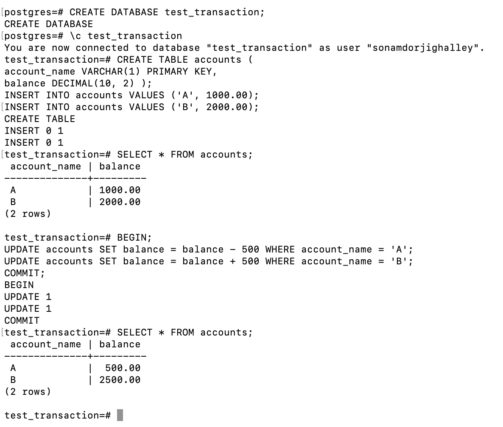
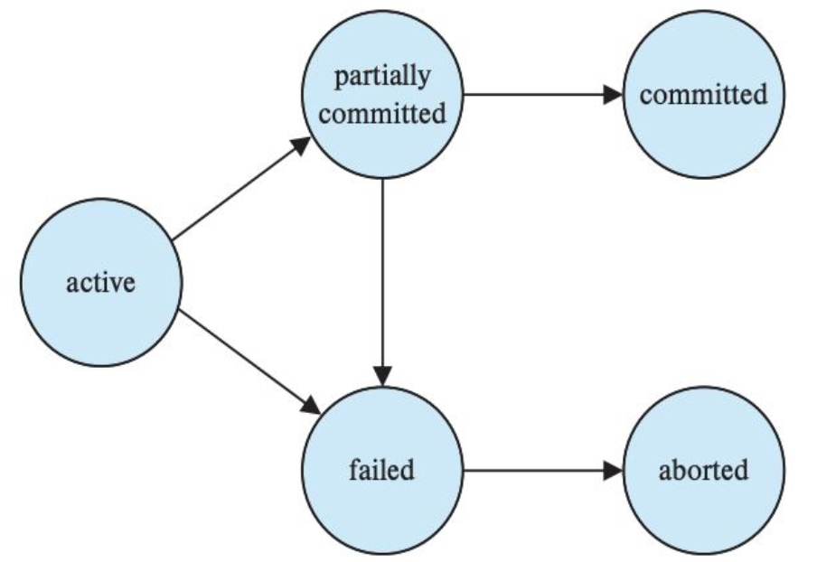
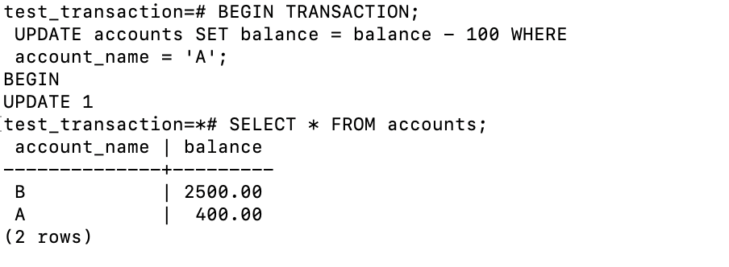
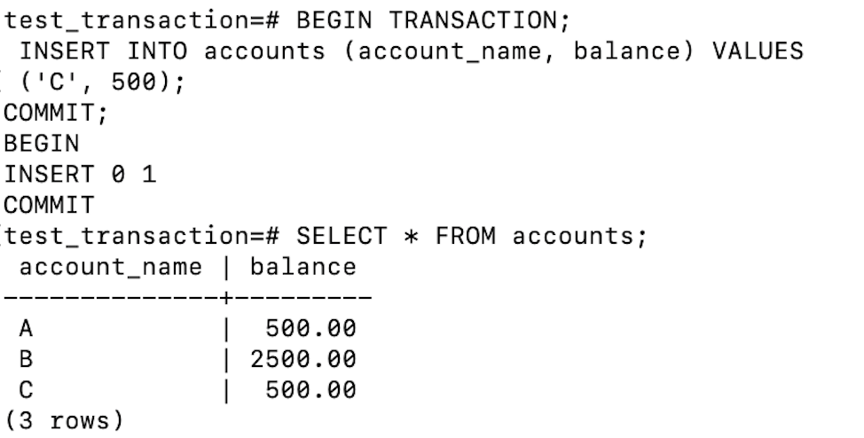
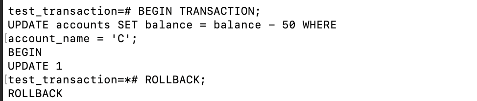
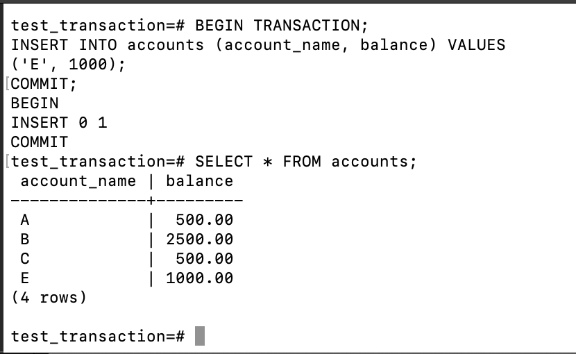
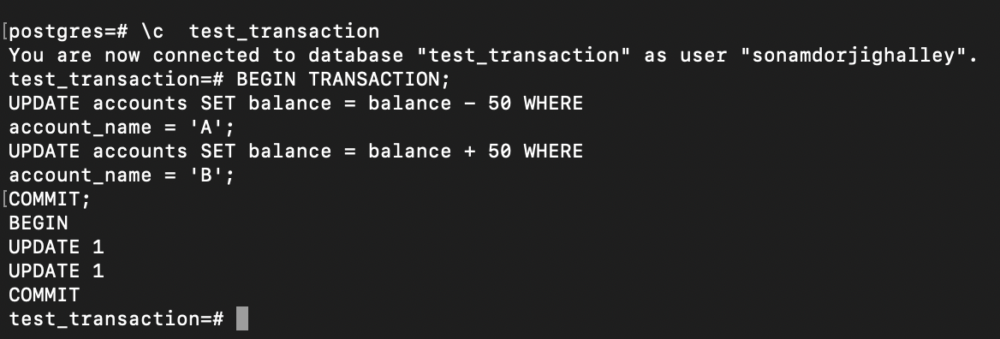
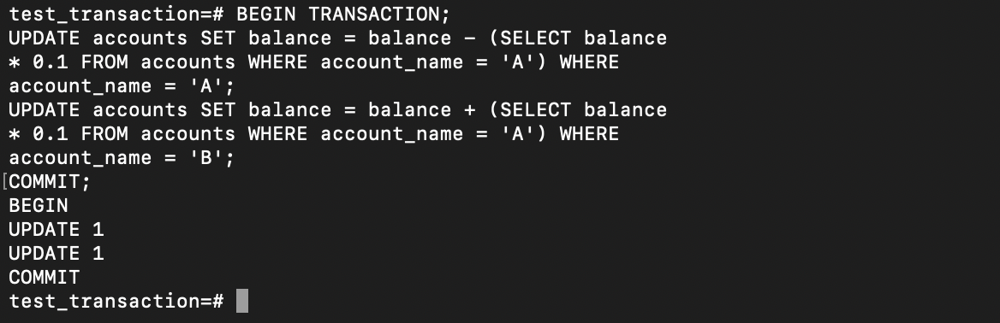

### Transaction 

**What is Transation?**

Transactions are sets of operations performed to modify data, including insertion, updates, or deletions. These transactions have various states indicating their progress and required actions. They ensure data consistency even during system failures, demonstrating a key advantage of DBMS. Transactions, executed repeatedly, like ATM withdrawals, generate multiple instances, each maintaining database integrity through specific properties.

#### Transation Properties 

**ACID Properties**

- Atomicity: The outcome of a transaction can either be completely successful or completely unsuccessful. The whole transaction must be rolled back if one part of it fails.

- Consistency: Transactions maintain integrity restrictions by moving the database from one valid state to another.

- Isolation: Concurrent transactions are isolated from one another, assuring the accuracy of the data.

- Durability: Once a transaction is completed, its modifications remain in effect even in the event of a system failure.

#### A Simple Transaction Model

So for today lets do a real time example for Trasaction:

So firstly in this, a new datanbase is created called test_transaction and than connected to that database. After that a table "acount" is inserted in the the database with columns "accoun_name" and "balance" and two row are inserted in the table wirth name "A" and "B" have balances of 1000 and 2000

A trasaction is then started with the `BEGIN` with the condition that balance of "A" decreases by 500 and balance of "B" increases by 500. And this update are than commit by the `COMMIT` command ensuring the changes are saved. The  final SELECT statement verifies the updated balances, showing account 'A' with 500.00 and account 'B' with 2500.00, demonstrating the successful execution and atomicity of the transaction.

#### A simple abstract transaction model:

- Active: The transaction starts with active state and remains active while the transaction is executing and making changes.

- Partially Committed: when a transaction completes it enters the partially committed state. This means that the transaction has completed its operations, but the changes have not yet been made permanent

- Committed: If everything is well and good the transaction moves from partially committed to committed.

- Failed: During the transaction if the the transaction is found to violate any consistency rules, it moves to the failed state.

- Aborted: The system undoes any changes made by the transaction, ensuring that the database is returned to its previous consistent state.

1. Active:

2. Partially Committed:

3. Failed:

4. Aborted:

5. Committed:

Lets consider a simple Transaction Schedules and Serial Execution

Example: Simplified banking system with transactions T1 and T2.

T1: Transfers $50 from account A to B.
T2: Transfers 10% of balance from A to B.

Serial Schedules:
- Schedule 1: T1 → T2. 
- Schedule 2: T2 → T1.

Ensuring Consistency with Serializable Schedules
Serializable Schedules: Guarantee database consistency under concurrent execution.
Objective: Ensure concurrent schedules equivalent to serial schedules.
Importance: Concurrency-control mechanisms maintain database consistency.
Database System Role: Ensuring all executed schedules leave the database consistent.

- Transaction T1: Transfer $50 from account A to B
Sequential execution ensuring consistency.

Transaction T2: Transfer 10% of balance from A to B
Sequential execution preserving database integrity.

#### Serializability

It checks whether there exists a serial schedule that is the same as a non-serial schedule.
Thus, we can see that the concept of serializability of the schedules helps us in verifying that a non-serial schedule is the same as a serial one. : It assists in ensuring that the numbers of transactions carry out their execution in harmony without intermixing each other. In laymen’s terms, one can conclude that the serializability is a technique that can be used to determine if two or many more transactions are preserving the state of the database or not.

**Importance of Serialization**

- Ensures isolation property of transactions
- Concurrent execution of transactions results in a
  consistent state
- Equivalent to executing transactions one at a time in
  a serial order

**Conflict in Instruction**

Two instructions I and J conflict if:
- They belong to different transactions
- They access the same data item
- At least one of them is a write operation

**Conflict Equivalence**
- Two schedules S and S' are conflict equivalent if: ○ We can swap non-conflicting instructions in S to
obtain S'

