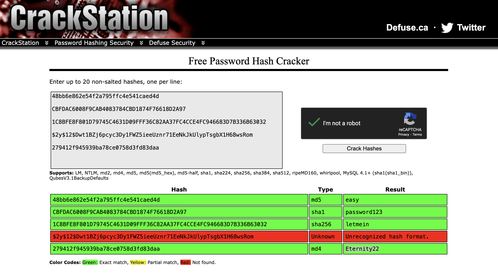
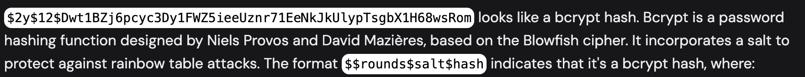
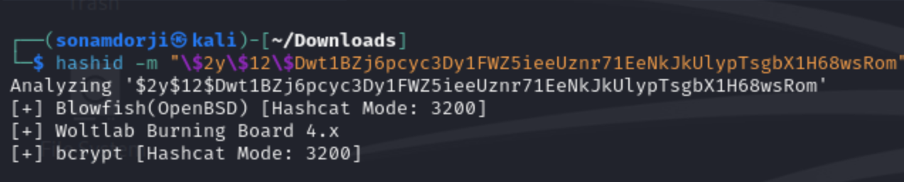
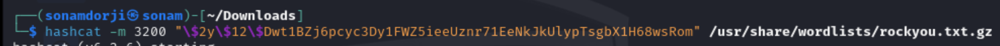
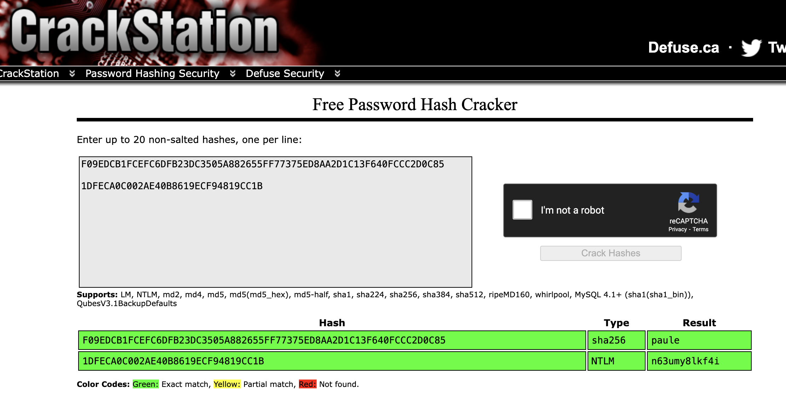
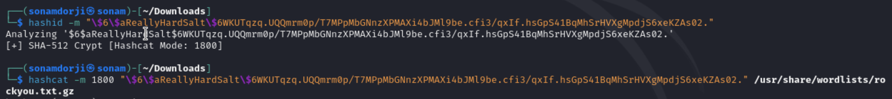

### Topic: Crack the Hash

Hello everyone! In this room we will be learning about cracking the hash

**Hash**: Hashing refers to the process of generating a fixed-size output from an input of variable size using the mathematical formulas known as hash functions. This technique determines an index or location for the storage of an item in a data structure.

#### Task1 Level 1

To crack the hash in this room I used crack station with is and online platform for cracking hashes.

    1. 48bb6e862e54f2a795ffc4e541caed4d

    2. CBFDAC6008F9CAB4083784CBD1874F76618D2A97 

    3. 1C8BFE8F801D79745C4631D09FFF36C82AA37FC4CCE4FC946683D7B336B63032

    4. $2y$12$Dwt1BZj6pcyc3Dy1FWZ5ieeUznr71EeNkJkUlypTsgbX1H68wsRom

    5. 279412f945939ba78ce0758d3fd83daa

As you can see we could crach the hash for 1, 2, 3, and 5 but for 4 it came with an error so to check what was wrong with I tried googling it and I found out that it was a different type of hash  

So therefore, it was a bcrypt hash and this type are more difficult to crack than compared to others. 

In the terminal I tried to know more about the hash so I used `hashid` command followed a parametre and I also added `\` infront of every `$` to make the hash see like a string.

now that i know the mode is 3200 so lets crack it using the following command. 

and the password was "bleh"

#### Task 2 Level 2

same as in level 1 i used crack station to crack some of the hashed passwords. For the first 2 passwords i used this site 

    F09EDCB1FCEFC6DFB23DC3505A882655FF77375ED8AA2D1C13F640FCCC2D0C85

    1DFECA0C002AE40B8619ECF94819CC1B

for the last two password since it was salted so we need to do with a different method 

firstly we need to find the tyope and mode for this hased password aand than use hashcat with this to crack the password 

After the hashcat i found out the password was "waka99"

    e5d8870e5bdd26602cab8dbe07a942c8669e56d6
 For the last password i checked its hashid and i found out that many types were there.

so i went to hashcat website and checked what all the different hash type were. and than i went to mode i found out that the 110 had some salt in it than i used that mode in this problem 

after i ran this command i was able to get the password as "481616481616"

    

