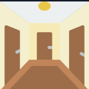
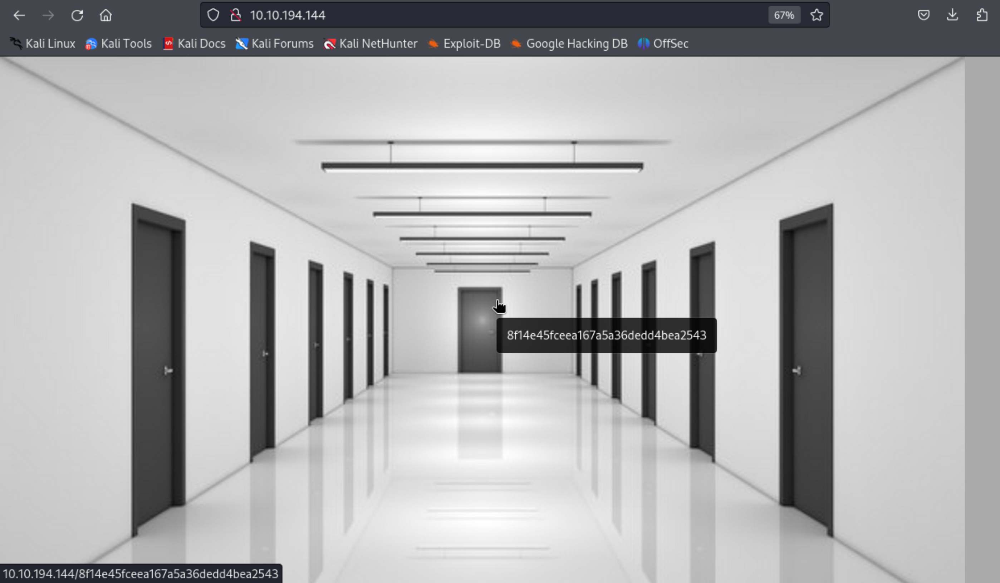
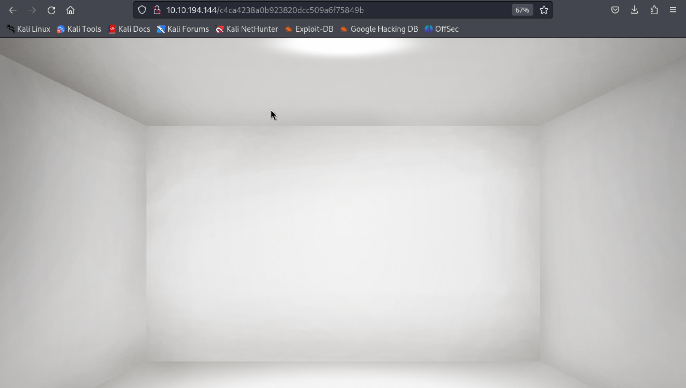
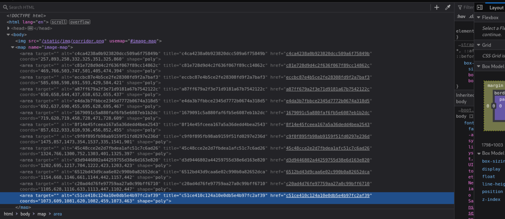
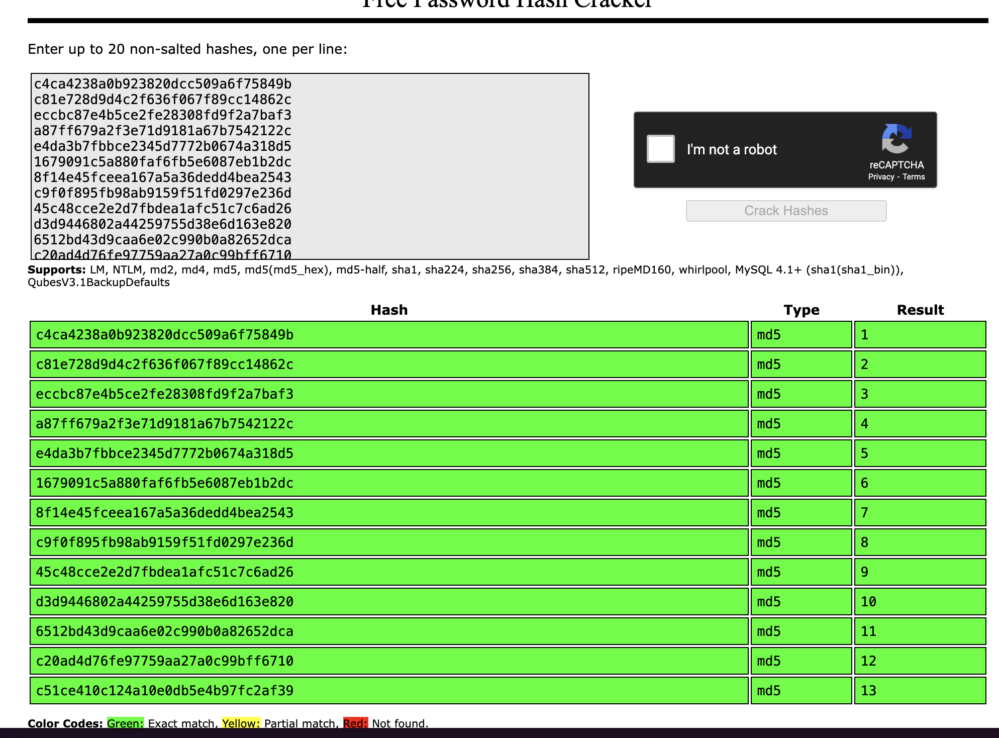
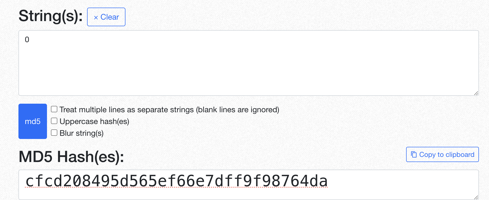
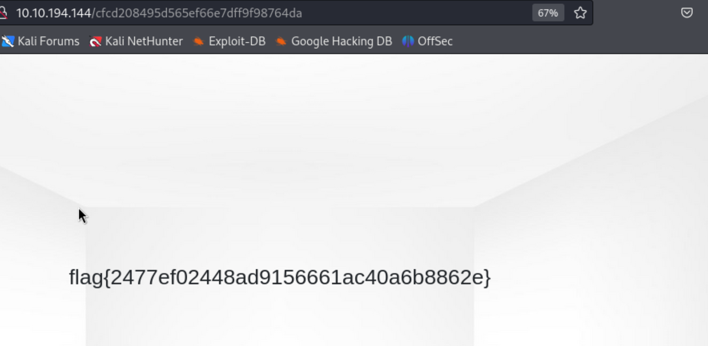

### Topic: Corridor 

Welcome back lets do an another CTF from Try Hack Me. And in this room we will be doing on web endpoint and decrypting the hashes and look at there pattern to solve the room 

firstly when i open the room i get this question 

](../image/corridor_question.png)

After reading the question i wnet to the brower and pastedthe IP address of the room that directed me to a webpage containing many door 

and each door had its own endpoint in the form of a hashed code represting the room number. 

so to get the room number i tried to do un-hash all the hashed room number by inspecting it and using crack station to un-hash them.

and in the pattern i could see that the room is 1 till 13  starting from the left side of the room. 

so the to find the flag the next room could be 14 or the starting room could be 0 

for this i used hash generator online to generate hash code for 14 and 0. i tried for 14 but that was not it and than i tried for 0.

