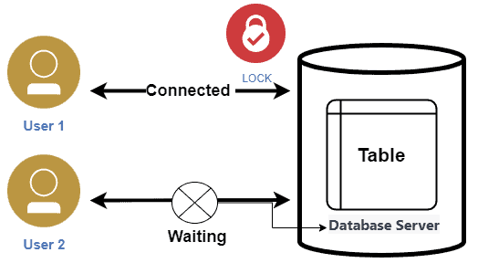
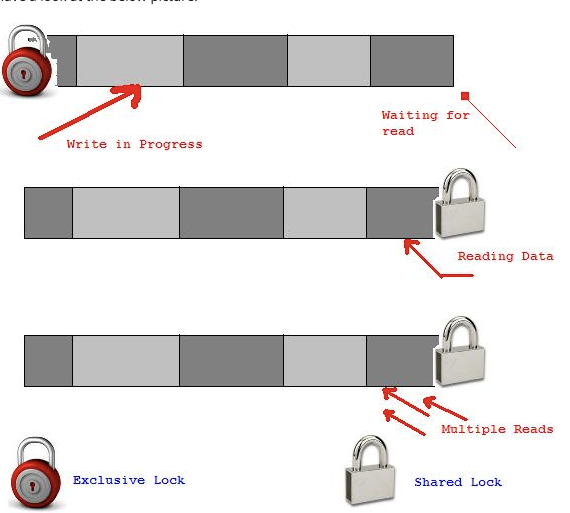
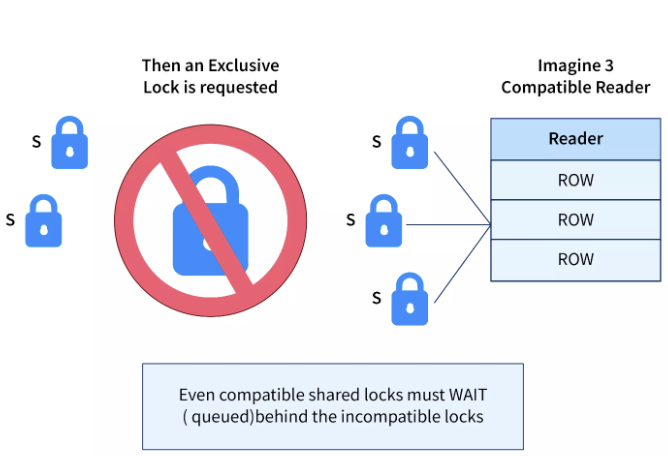
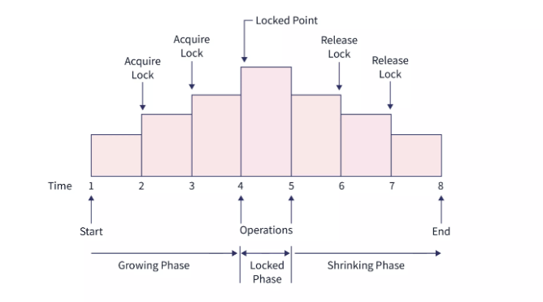
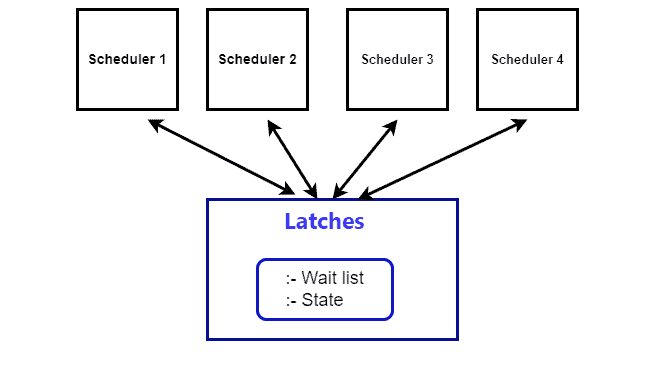
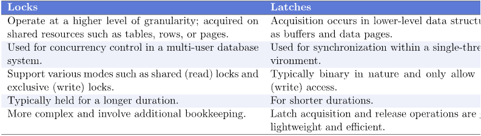
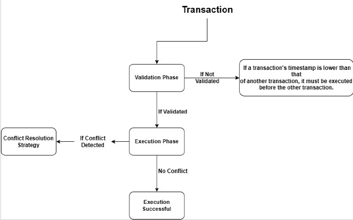

## Lock and Laches

Hello!! Welcome agian this time we will be talking about Lock and Latches in Data base system and how it maintain the consistence of the data. But before that lets talk about concurrent controls and how it impacts in this topic.

### Concurrent Control

Concurrent control is the mechanism by which a database can be accessed and updated by more than one transaction at the same time while ensuring that the quality and operational stability of the database is not compromised. In that, this statement is bound to the database, multiple transactions can run concurrently without the database being left in a bad state.

Parallel operations for executing different transactions increase the usage of resource and improve the capability of the database to process more number of requests at a time.

So that now we know what a concurrent control is lets jump into our main topic about locks and latches.

### **Locks in database**

Its sounds a bit odd to hear about lock in database but there sure is one for now. So what exactly is a Locks. Locks are a mechanism that provides control to more than one processes trying to use the same data at the same time. They support compliance with accuracy and integrity of data in the course of multiple transactions. 

A lock allows transactions to either read or write data, making sure that conflicts are prevented and that each transaction remains separate from others.

### Types of Locks

There are various modes in which a data item may be locked but we will focus on two:

1. **Shared Lock**

- A shared lock is a type of lock that allows multiple transactions to read a piece of data simultaneously, but prevents any one of them from modifying it until the lock is released. In other words, shared locks are used to ensure that data can be accessed concurrently by multiple transactions, without any of them being able to modify the data. For example, if two transactions want to read a piece of data at the same time, they can both acquire a shared lock on that data to ensure that they can access it simultaneously.

2. **Exclusive Lock**

- An exclusive lock, on the other hand, is a type of lock that grants exclusive access to a piece of data to a single transaction. It prevents other transactions from reading or modifying the data until the lock is released. Exclusive locks are used when a transaction needs to modify a piece of data, to ensure that no other transactions can access it until the modification is complete. For example, if a transaction wants to update a record in a database, it can acquire an exclusive lock on that record to prevent any other transactions from accessing it until the update is complete.

- Example: Let us assume that the details of some bank accounts are stored in a database table. Because multiple transactions may need to read the current value of the account balance concurrently while only one transaction may need to write a new balance, the account balance needs to be isolated. By having many transactions want to read the account balance, each can go and take a shared lock on the row of the table that contains their balance. In order to change the balance, a transaction has to take an exclusive lock on the row as any other transaction may not have access to it until all necessary changes have been completed.

### Granting Locks

Lock are granted only if no other transaction is holding a conflicting lock on the same data and no other transactions’ lock requests are before it on the same data. This method eliminates a situation where a transaction could be in a wait state, waiting for a lock and possibly never gets it because new requests that are compatible with the waiting transaction’s request are constantly being granted a lock.

#### Two Phase Locking Protocol

One protocol that ensures serializability is the two-phase locking protocol. This protocol requires that each transaction issue lock and unlock requests in two phases:

1. **Growing Phase**: New locks on data items may be acquired but none can be released.
2. **Shrinking Phase**: Existing locks may be released but no new locks can be acquired.

In the above figure, we can see that in the growing phase, all the locks are obtained till the point when all the locks needed by the transactions are acquired. This pint is called Lock-Point. After the lock point, the transaction enters the Shrinking phase.

### **Latches in database**

Yet again it may sound a bit weird to hear Laches in database but it exists. So A Lock is a synchronizing mechanism, which is employed for the purpose of concurrent types of accesses and to guarantee data integrity. Real-time or active locking is usually accomplished by latches in database that protects the shared and accessible resources like data structures or buffers from concurrent access by different transactions or threads. 

A latch allows acquisition and release to happen quickly usually within just one cycle of the central processing unit making the protection of frequently used data structures within a database efficient.

Latches can be classified according to the way they handle access conceptual and non-conceptual. Open latches allow multiple transactions or threads to have READ access on a specific block or a record. Exclusive latches provide writers with permissions to write to the objects, which ensure that multiple processes do not write to the same objects at the same time.

### Timestamp Ordering Concurrency Control

Another interesting concept of database management systems is a concurrency control which provides the transaction isolation and keeps database consistent. Another mechanism for handling concurrent activities in a transaction is the timestamp ordering, where the transactions are assigned timestamps then ordered accordingly. What is ToM? What is the reason behind its existence? How does it ensure transactional integrity? BOOM!

Timestamp ordering’s primary purpose is to ensure the phenomena of serializability – in a very broad definition, it means that whenever a set of transactions is executed, their ordering must generate the results that would have occurred if all transactions had been executed in a linear sequence. Below are the major objectives of Timestamp ordering

- Transaction Ordering − In order for the transaction outcomes and timestamps to match, the transactions must be carried out in the right order.

- Conflict Resolution − If two transactions are in conflict, the timestamp ordering mechanism must choose between terminating one of the transactions or postponing it until the other transaction is finished

- Deadlock Prevention − To avoid deadlocks, which occur while several transactions are awaiting one another's completion, the timestamp ordering mechanism must be used.

The timestamp ordering algorithm is based on the idea of creating a unique timestamp number when every transaction comes into the system. This information corresponds to the beginning of the transaction time and is used to arrange the transaction flow. The algorithm consists of two phases: The validation phase includes the activities that are carried out to ensure that all plans are in harmony and are ready for implementation, while the execution phase involves the practical process of putting the plans into action.

Timestamp ordering is another concurrency control method which assigns a unique timestamp to all the transactions and sorts the transactions by these timestamps. The technique guarantees serializability helps to resolve the conflicts between the transactions and prevents the occurrence of deadlocks. One of the most used Concurrency Control Mechanism in Database Management Systems is the timestamp order that has high concurrent capability with transaction integrity.

