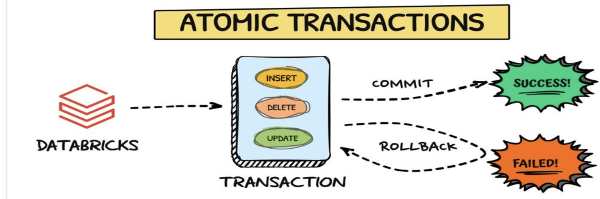
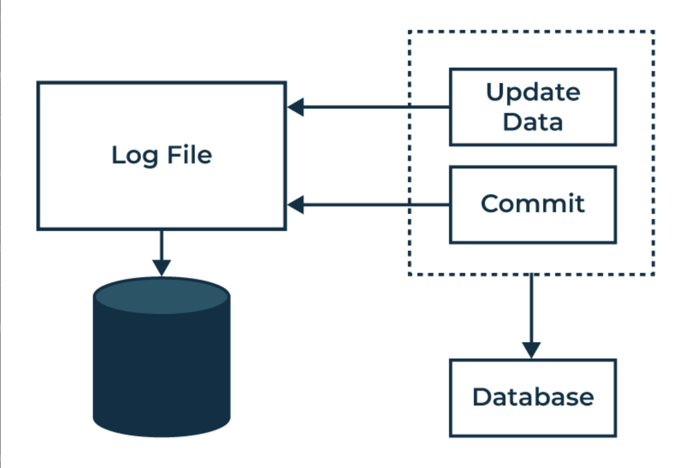

## Recovery Systems in DBMS

Recovery systems are the basic components of the DBMS that enables the system to recover from abnormal termination or crash.

Recovery systems in DBMS are important in order to perform tasks of ensuring data protection in case of various failures and error occurrence. Such systems address challenges such as system failure, transaction loss and reversal, human error and/or fraud, theft and/or embezzlement, hardware obsolescence or natural disasters, compliance to laws and norms, and data alteration.

#### Atomic Transactions

Another essential property of a transaction is that it must be atomic. A set of actions must be performed in its entirety without interruption or (under certain conditions) it cannot be performed at all. This can be ensured using LOG BASED RECOVERY that acts as a record of all the changes made to the database.

### Log Records

A log is a collection of first records that maintains records on all the changes made to a particular database. As a result, if any alteration is set to be made, the current log record is modified to capture the new status. This log includes:

- Transaction Identifier (Ti): These decisions are executed under a particular and distinct ID number for the transaction.

- Data Item (Xj): Each data items has the following characteristics: Unique Identification of the data item.

- Old Value (V1): The previous value that was in existence before the change can be implemented.

- New Value (V2): The quantity value after applying the change on it.

Other log record types include:Other log record types include:

- Ti start: Indicates entry of a transaction.

- Ti commit: Terminates a successfully completed transaction or a sequence of actions leading to its completion.

- Ti abort: Used to indicate a planned and coordinated insufficient funds of a transaction.

### Database modification techniques

- Deferred-Modified: They update the database only after a juggler commits.

- Active-Immediate Modification: Changes can be done while transaction is active.

Recovery algorithms have to take into account a lot of things: making sure that committed transactions are correctly saved and that any uncommitted changes are aborted in case there was a failure.

#### Undo and Redo Operations

- Undo Ti: Writes to data to make it equal to state during a certain point in time via log records, typically used for transactions that did not commit.

- Redo (Ti) : Redo is available in the Database as a file, Any Committed Transactions should be available in the database, So Redo re-apply the changes to make sure the committed transactions are reflected in Database.

#### Handling System Crashes

- Transactions require undo when no commit or abort record was found
The presence of start and commit/abort records indicated to the redo manager that transactions needing redo had these pairs of records.

#### Checkpoints

At intervals, checkpoints save the database state cutting down on the length of log needed to be analyzed after a crash. This reduces recovery time and effort by ensuring only recent changes need checking.

#### Fuzzy Checkpoints

While enabling transactions to continue during checkpointing and providing some flexibility, fuzzy checkpoints have added complexity in recovery.

#### Log Record and Database Buffering

To avoid overheads log records are stored temporarily in memory before being written to stable storage. Policies like no-force (commit without immediate write) and steal (write modified blocks before commit) help manage this.

#### Recovery from Major Failures 

In cases where there is severe failure resulting to loss of non-volatile storage, the database is periodically backed up. Recovery starts from redoing changes since that backup using the latest backup available.

#### High Availability and Remote Backup Systems

Remote backups keep an updated replica using log shipping from primary site. In case of failure at the main location, it should switch over leading to high availability.

#### Recovery Algorithms

Database consistency and durability are ensured by recovery algorithms such as ARIES. In summary, ARIES includes:

- Analysis Pass: Identifying transactions to undo/redo, and dirty pages.

- Redo Pass: Reapplying changes in order to return the database back into its pre-crash state.

- Undo Pass: Rolling back incomplete transactions.

#### Recovery in Main-Memory Databases

Data in main-memory databases is kept there for quick access. Recovery uses traditional methods, but with enhancements such as avoiding redo logging for index updates and parallel recovery across CPU cores.

