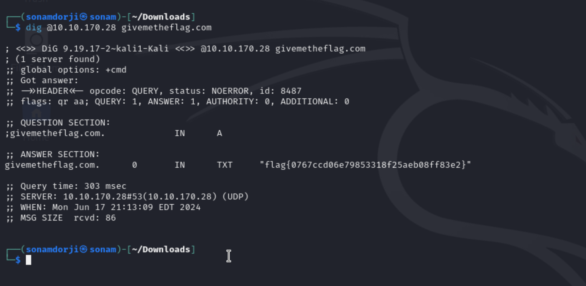

### Topic: Dig Dug

Hello! in this CFT we will be doing the dig dub where we need a little knowlegde on DNS  what it is . Domain Name System (DNS) is the protocol responsible for resolving hostnames, such as tryhackme.com, to their respective IP addresses.

so in the description it says the IP address of the machine is the DNS of the server and it only responds to "givetheflag.com".

so for this i used the `dig` commnad to solve this. 

**What is dig?**
The dig (domain information groper) command is a flexible tool for interrogating DNS name servers. It performs DNS lookups and displays the answers that are returned from the queried name server(s).

Our SERVER is the IP we got to attack (in my case 10.10.43.202) and our DOMAIN_NAME is givemetheflag.com.

