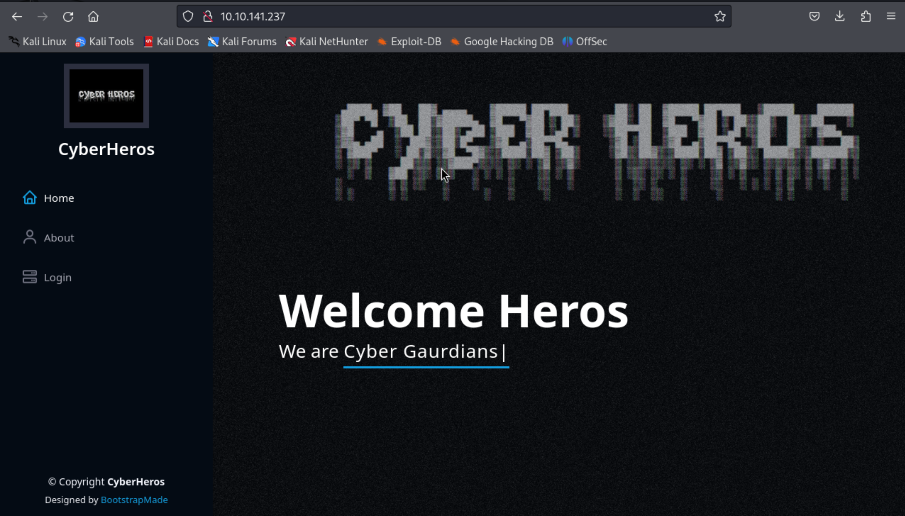
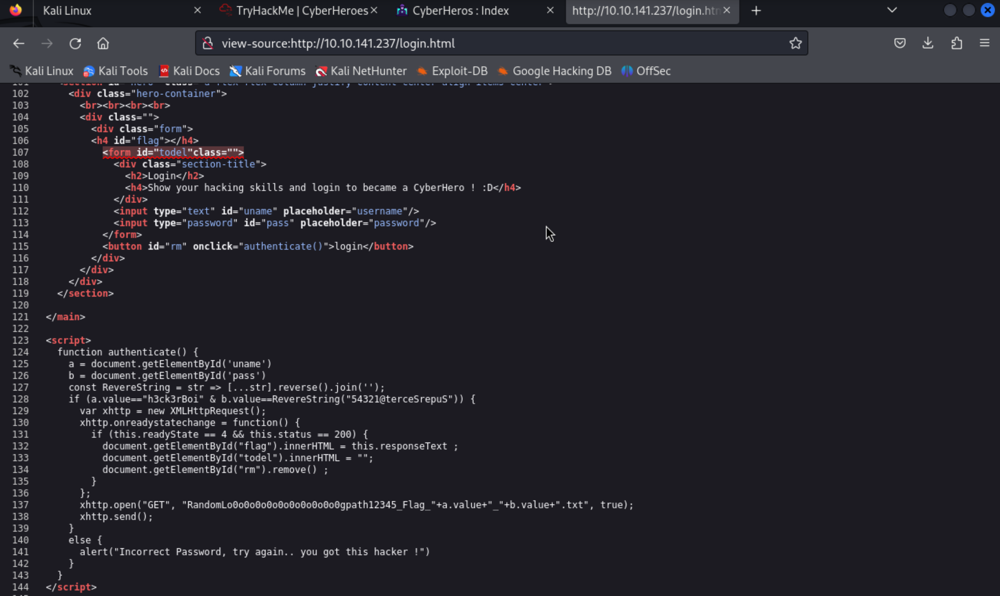
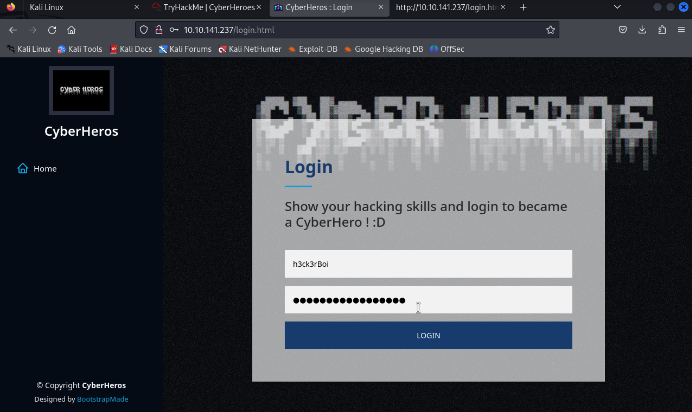
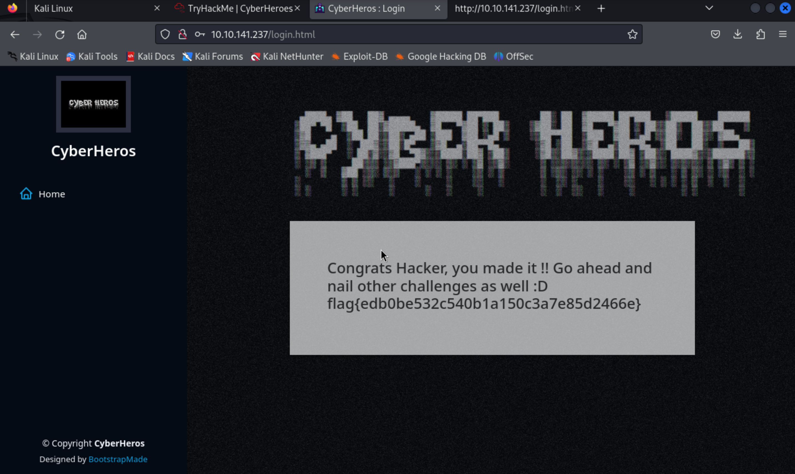

### Topic: Cyber Hero 

Hello Hackers!! welcome back, in this CFT we will be doing Cyber Hero where in this we will learning about authencation bypass.

So firstly as the question suggested i went to browser amd pasted the IP of the room and it directed me to a site.

And after exploring the webpage i came across the to see the source code for the website. In the source for the home page there was nothing such special to explore, just random image that were uploaded in the website

And i jumped to the soure code for the login page since our main objective was to bypass the authencation, this can only happen in the login site. After hovering around in the source code i saw something intresting and eye catching.

in the souce code i could see that the authencation is done when the only the value in the "usermane" and "password" is give with the particular value.

the values for username which was stored in the variable "a" was "h3ck3rBoi" and the for the password which was stored in the variable "b" as reserve of this string "54321@terceSrepuS" which is "SuperSecret@12345"

So i used this credentails to login this site in the login page. 

