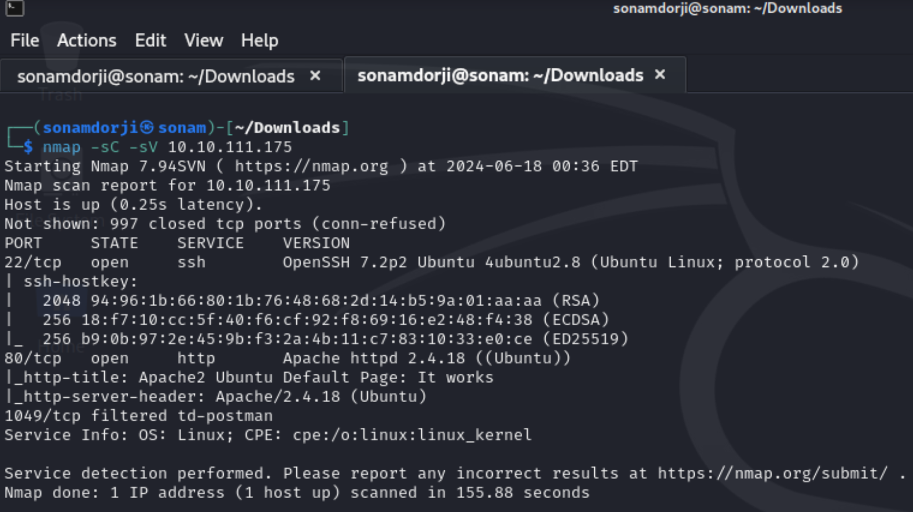
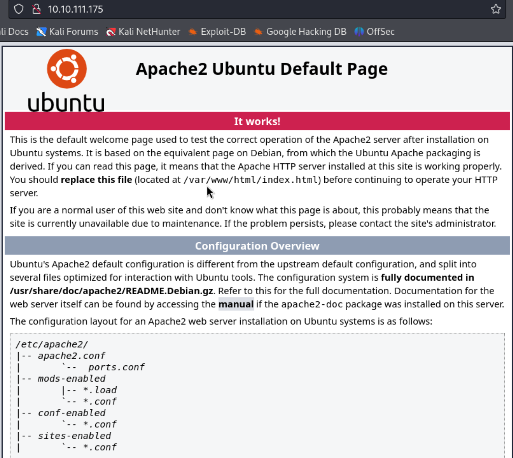
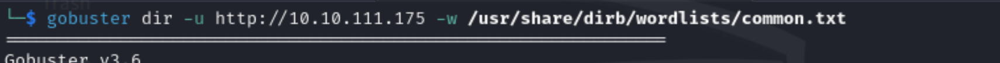
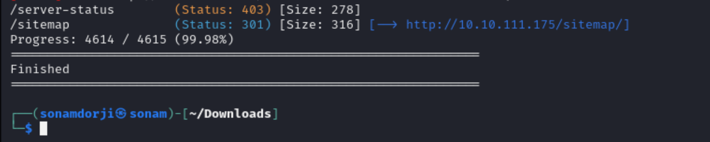
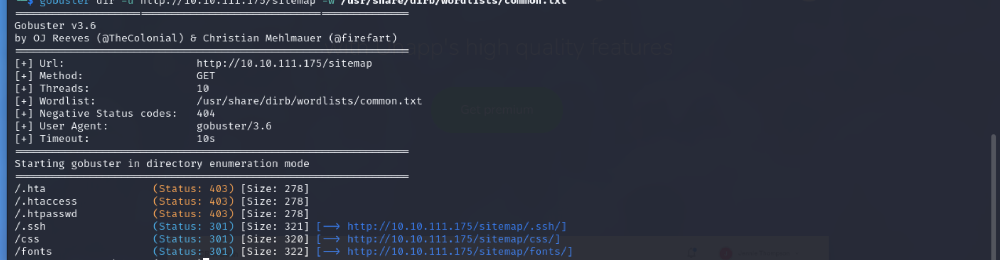
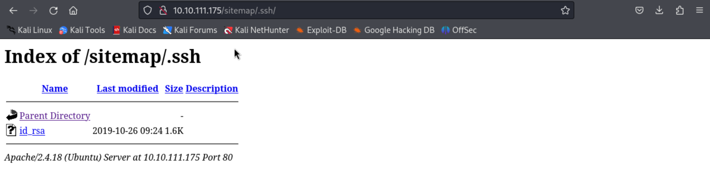
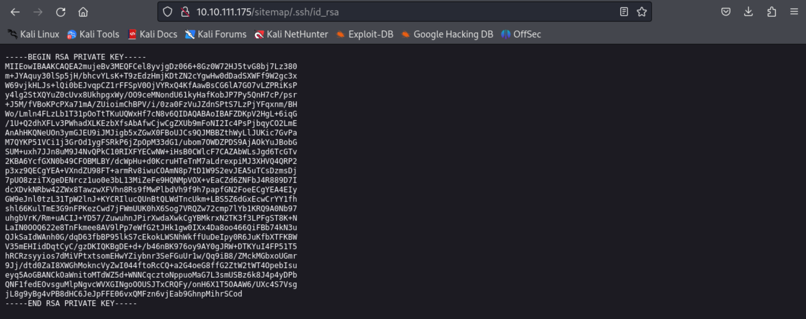
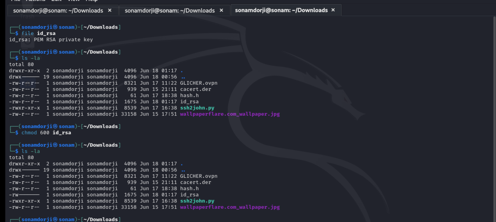
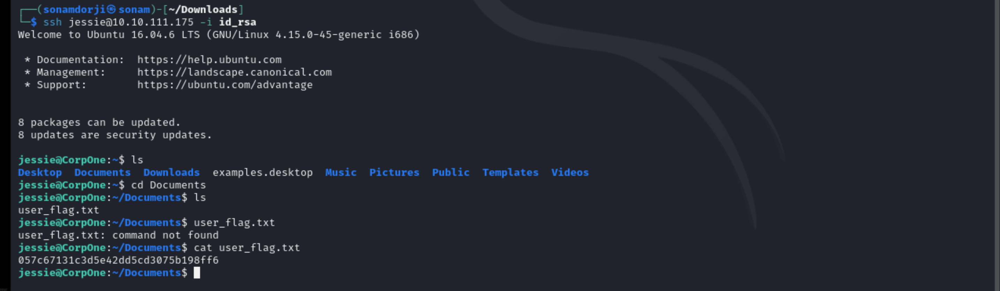

### Topic: Wgel
 
In this room we were not given any clue from where to start and how to proceed to get the flag.

First Let’s begin with the nmap scan and see what all are the different ports open in this IP address.

I found that there are 2 ports open i.e 22 and 80. Then when I pasted the ip address in the browser it directed to a apache2 ubuntu default page.

We didn’t find anything intresting on this page. Now let’s see what all are the hidden directory to proceed further by using  gobuster . 

Intrestingly there were 3 diirectory in which  /sitemap directory caught my eye and tried to explore further  but i also checked the other directories and founf nothig useful . 

So going to the /sitemap directory it show me fully functional website and again there is nothing such in this page. So there may be further hidden directory on this site so let’s find it again using gobuster.

We got many directories in this site but as /.ssh was common where passwords can be stored so went to that diretory.

When i went to that directory there is a id_rsa and contain the rsa private key which can be used to login to the ssh.

Copy this private key and save it in local file for it to be used later while logging in.

Run  command `file id_rsa`  to set a password to be used for logging in. At first id_rsa file is not in a executable mode, and for that we need to change it to executable mode by using the command `chmod 600 id_rsa`.

Then login to the ssh service using that id_rsa and capture the flag.

