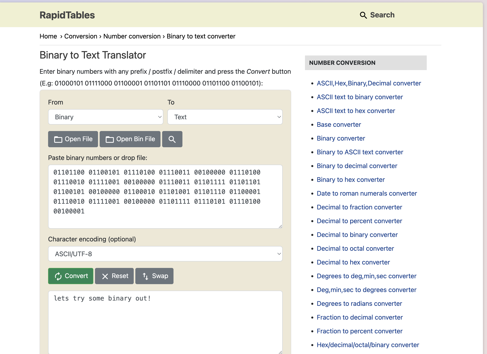
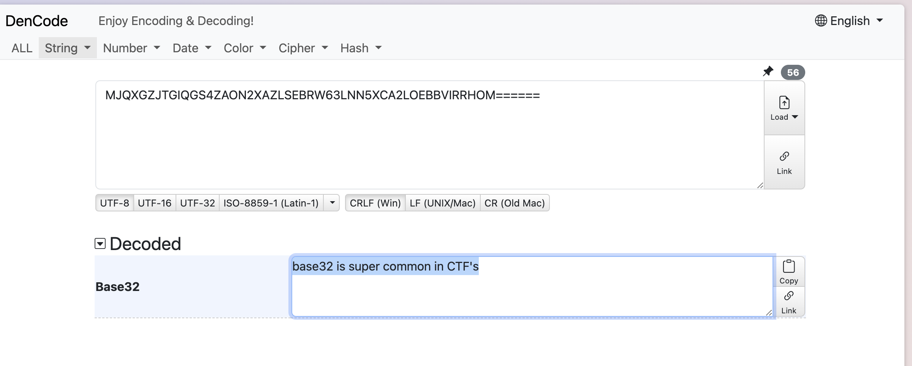
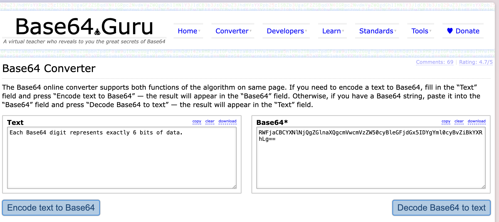
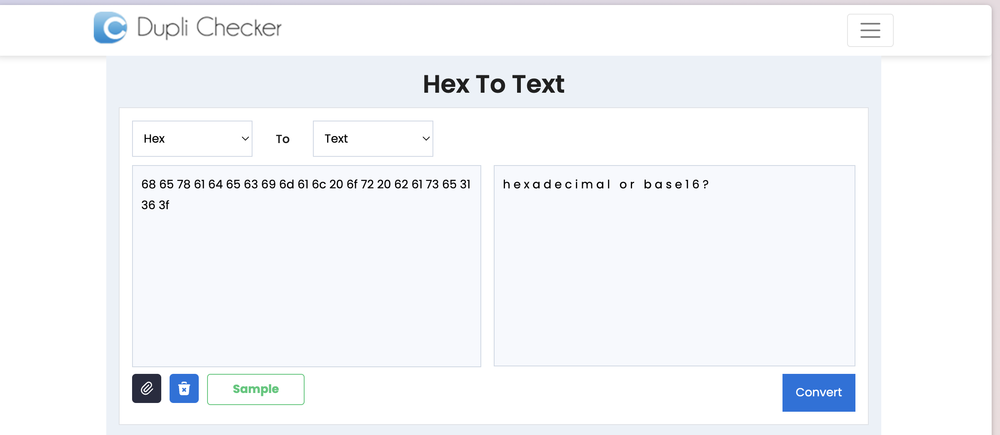
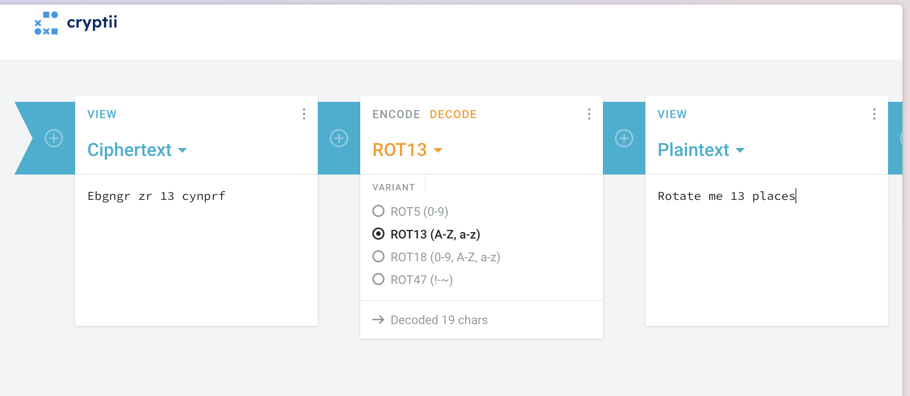
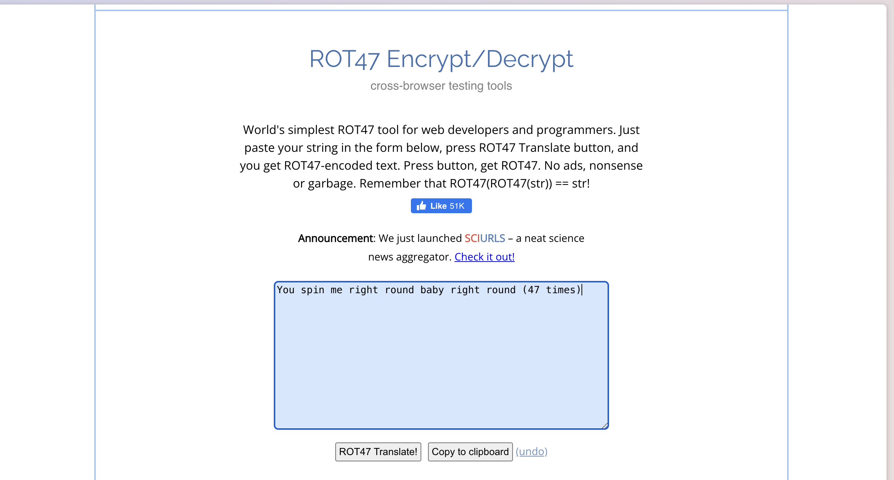
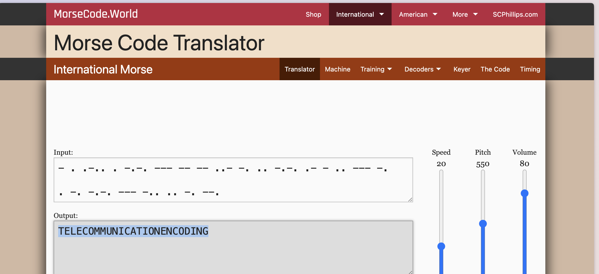
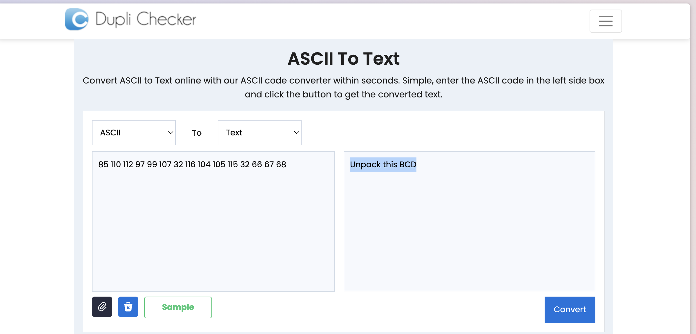
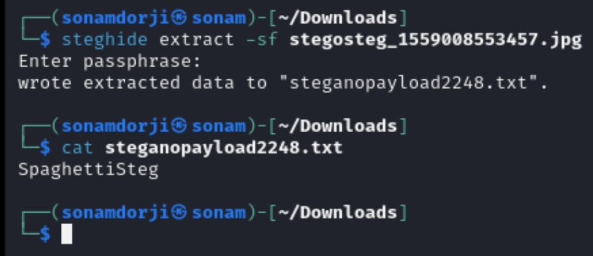
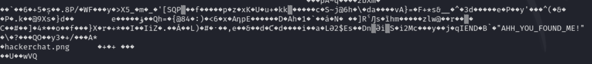

### Topic: c4ptur3-th3-fl4g

#### Task 1: Translation & Shifting

1. Translating the first code was simple, we just needed to apply a bit of logic, where numbers can be read as the letter and directly getting the flag.

**Note: To check the tyoe of hash i just copy pasted the hash and found avboit it**.

2. Second code is in binary form so I will make use of an online tool to decode . One of the best online tools is RapidTables.

3. The third code is base32 type so using the online tools for base32 decoder I got the decoded string.

4. The fourth code is base64 type and for that we need to use base 64 decoder. Base64 guru gives the answer.

5. The fifth code is ASCII code. In browser search for the ascii decrypt. 

6. The sixth code is the ROT-13 cipher. Depending on the the type of code we need to choose the tools.

7. The seventh code is Rot-47.

8. The eight code is Morse code

9. The ninth code is ASCII.

10. The tenth code is the combination of different type so to decode this follow this (Base64-> Morse Code-> Binary-> ROT -47 -> ASCII).  

#### Task 3: Steganography
For this we need to download a task file and extracting the hidden file using `Steghide`. it works by embedding our hidden data within an audio, image, or video file. 

`steghide`: This is the tool being used. steghide is a command-line utility that allows users to embed and extract data within various types of files, commonly images or audio files. It supports several types of embedding algorithms and can work with different types of files, including JPEG, BMP, WAV, and AU files.

`extract`: This specifies the action to be performed. In this context, extract tells steghide to retrieve the hidden data from the file.

`-sf`: This option specifies the file from which data will be extracted. Here, -sf stands for "stegofile," indicating the file that contains the hidden data.

So after extracting the hidden file from this i got the flg for this task.

#### Task 4: Security through obscurity

Same as in the earlier task we again dowmload a image file and extract the hidden file from it.

but for this case we didnt had to to extract the file but rather directly read this file and we got the flag.

