### Topic: Lazy Admin

Hello welcome back to another CFT room and in this room we will doing this room to expend our knowledge in Linux comnmands.

So  basically i  started this room with and nmap scan to see the port open this room, and in this i found that:

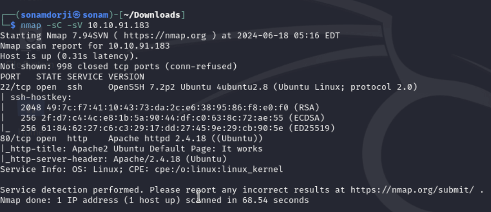

so i went to the browser and and pasted this IP address.

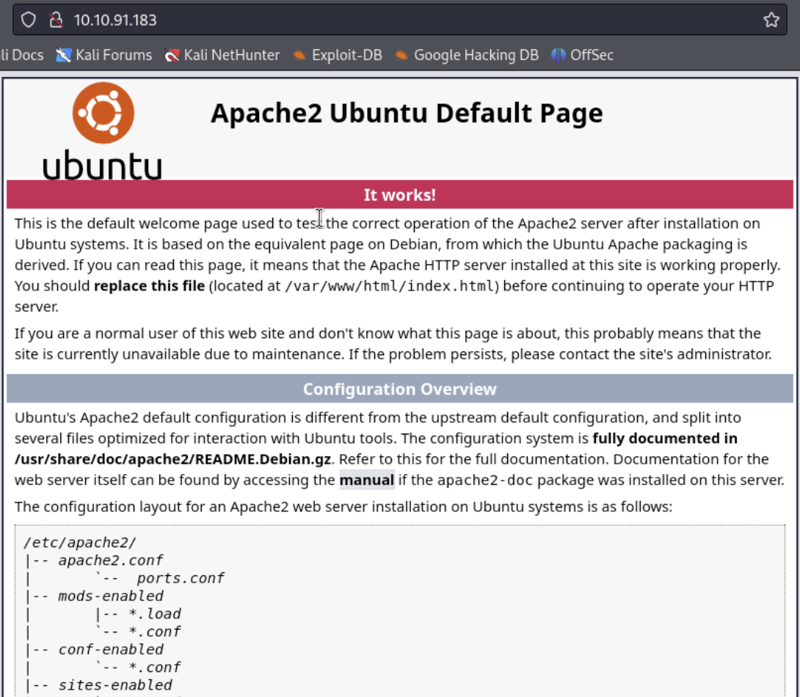

so i tried some common directories with gobuster and got the following:

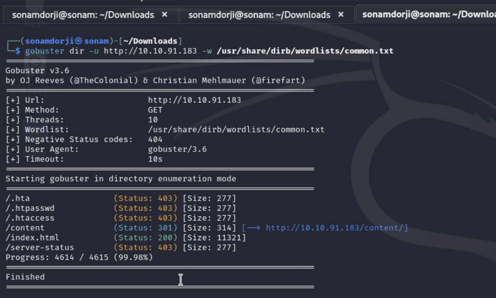

In the /content i got the following message:

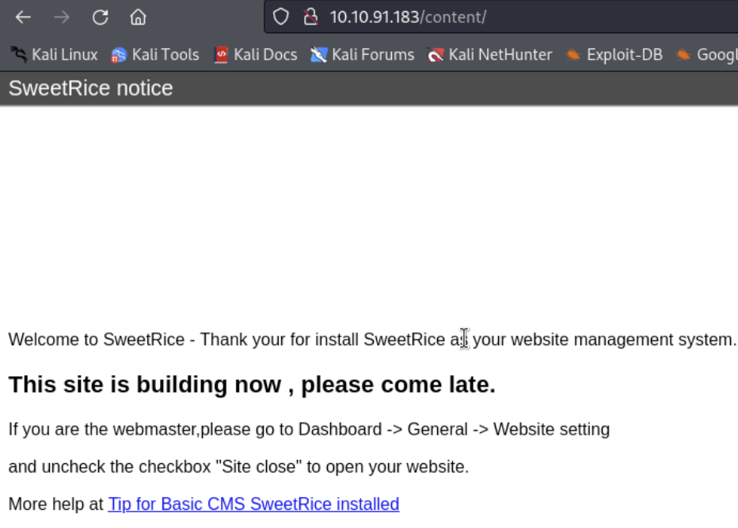

In which i never heard of the term sweetRice and i tried to expand the knowledge and again did gobuster on the content directory an d found the following:

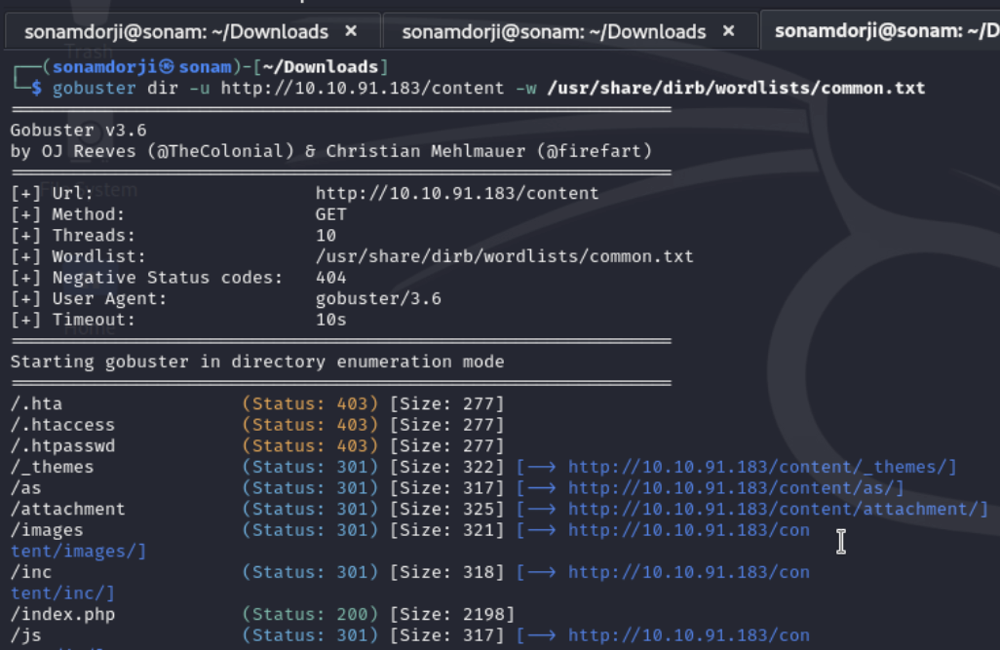

So i went into the /as endpoint and it gave me a login pager for the SeetRice website.

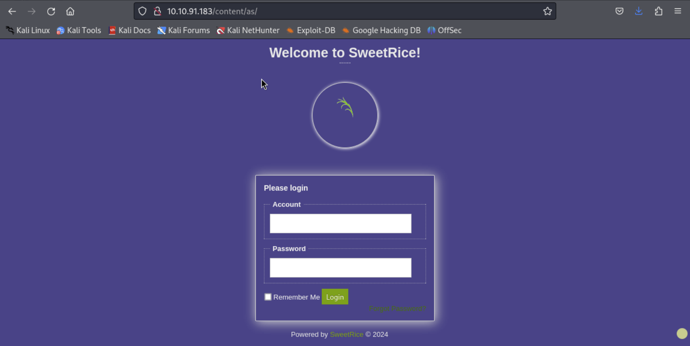

and also into /inc i got a bunch of directories.

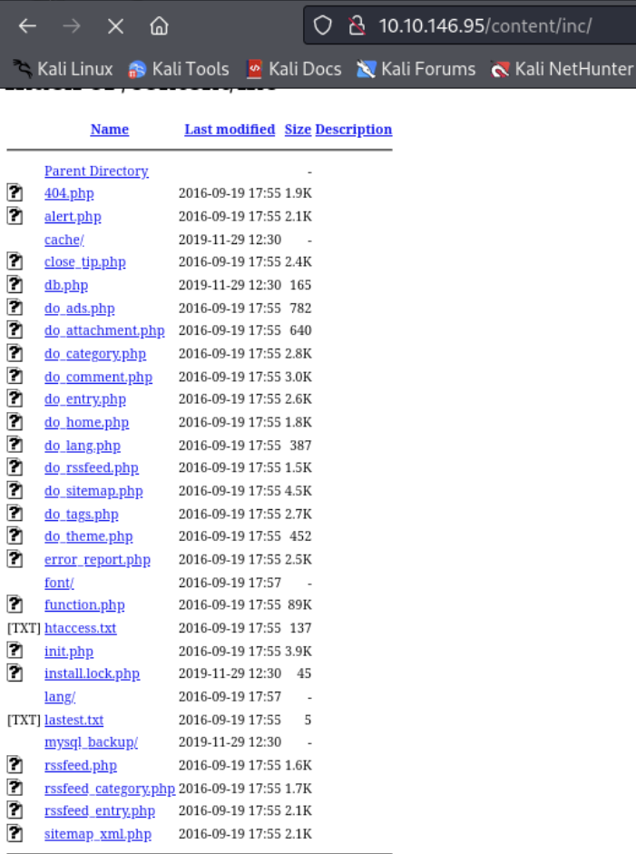

Than i went to the /latest.txt and i think i got the version here

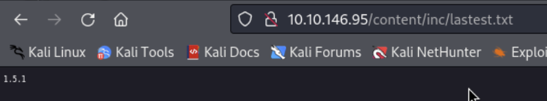

I also went to the "mysql_backup" and i think i found the username and password to login in the  SweetRice login site.

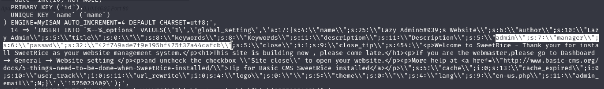

for the password i used crack station to crack hashed password 

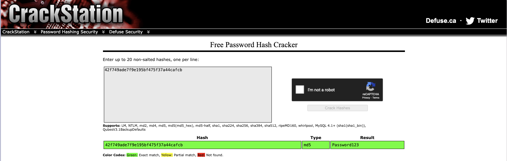

so i used this credentails to login into the login page and i was in.

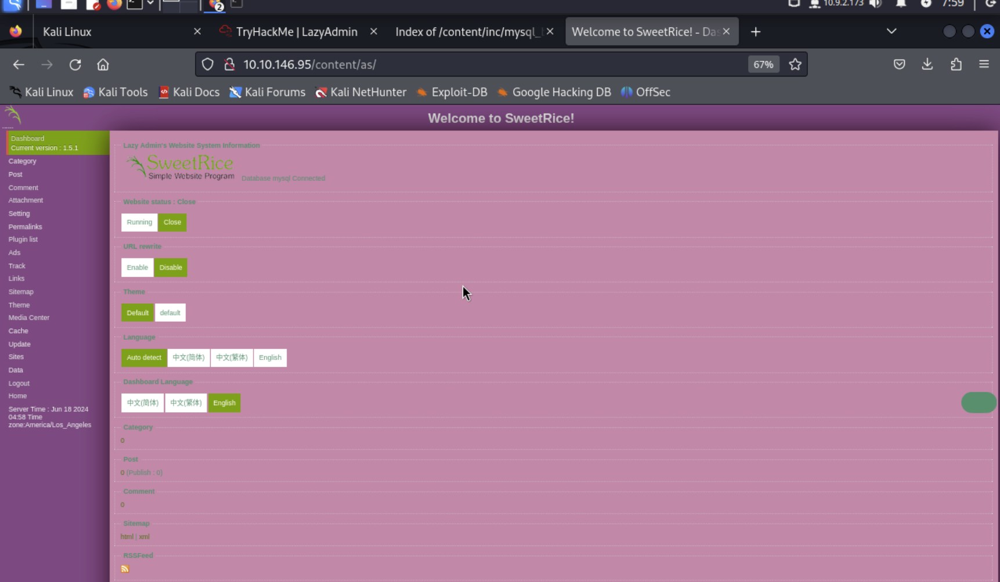

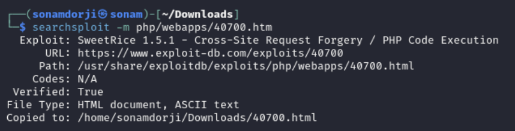

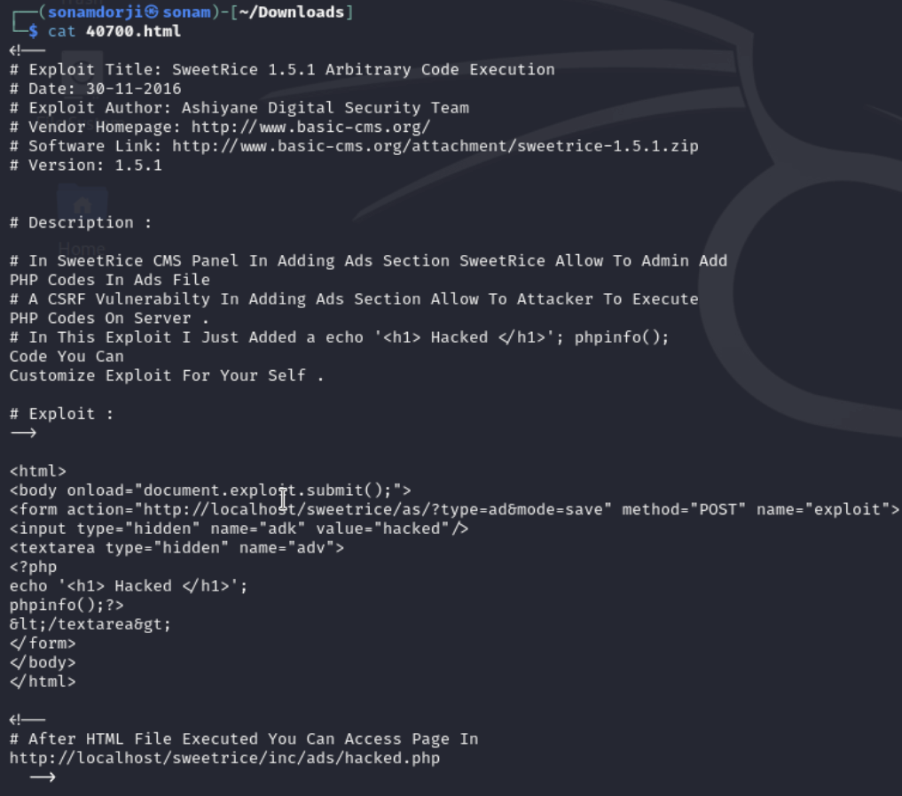

So according to this, I need to go to the Adding Ads section and upload this, which will allow me to add PHP code to the server.

 

